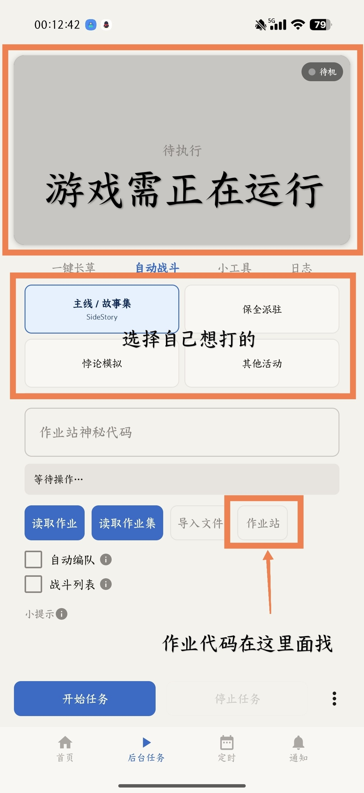
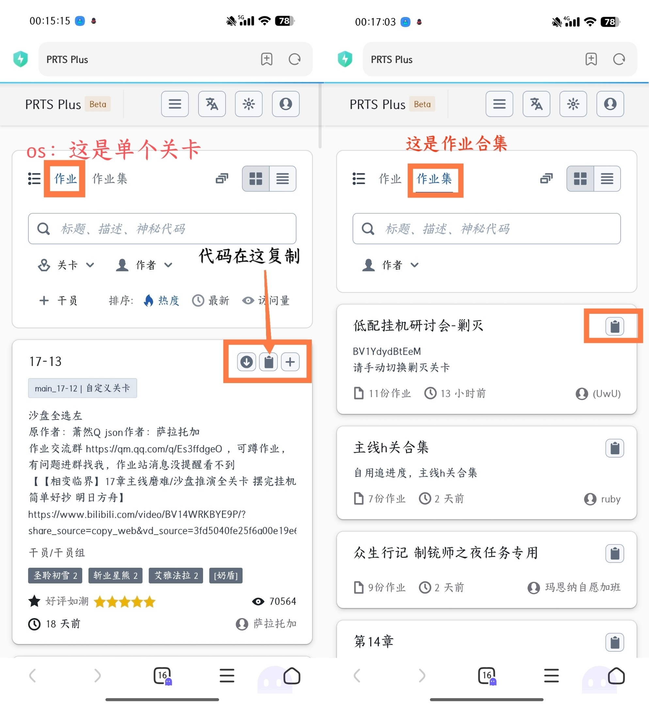
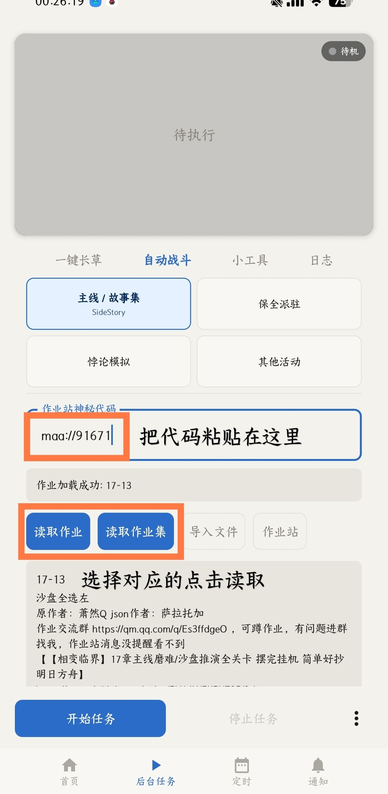
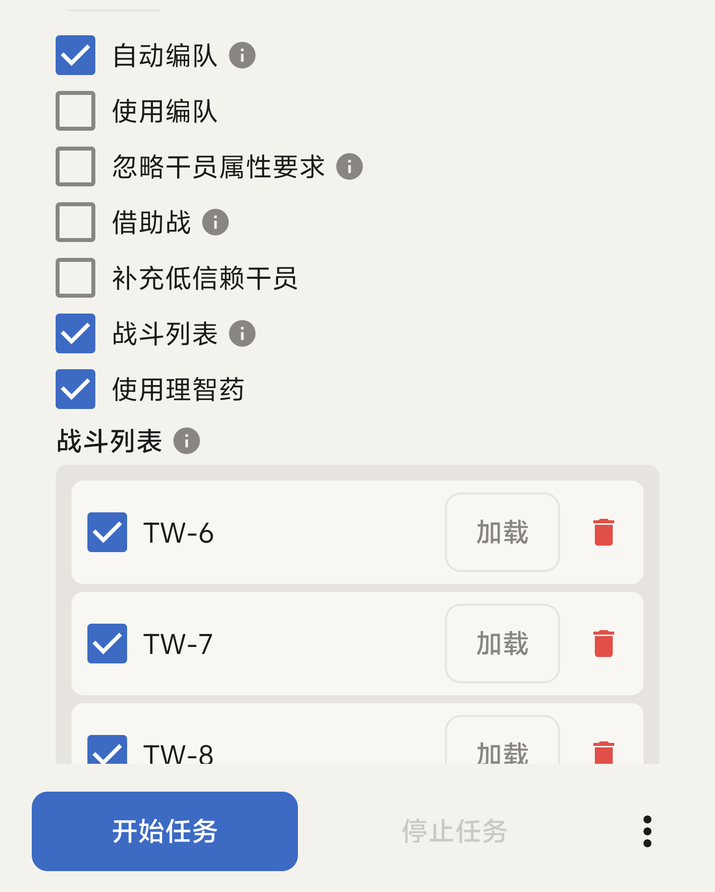
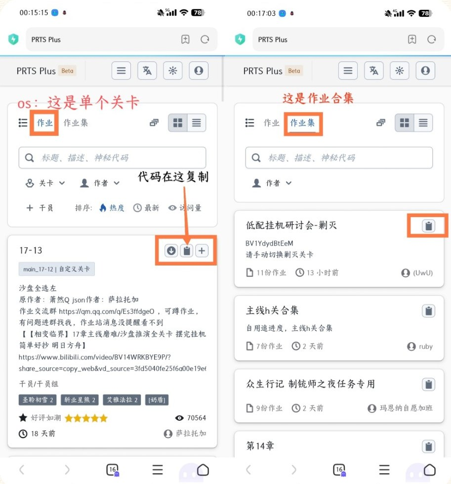
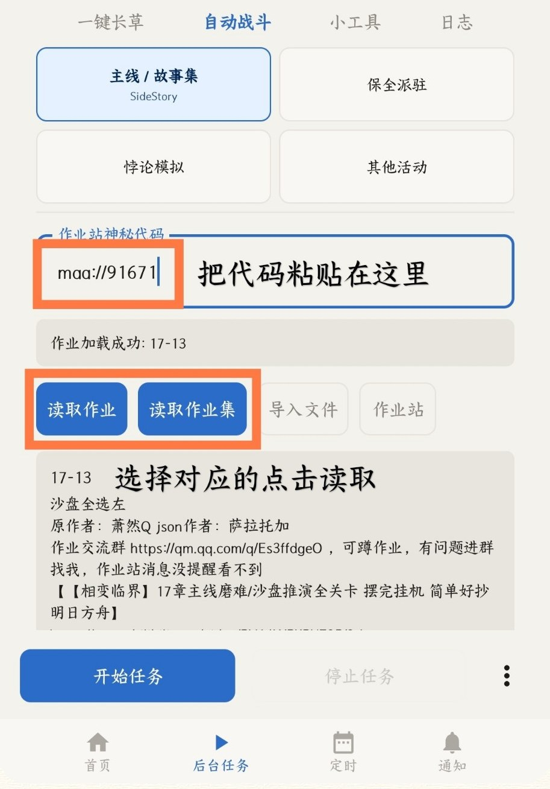

When you enable Auto Combat, these options appear: Use squad, Ignore operator requirements, borrow a support unit, and Add low-trust operators. When you enable Job List, the Use Sanity Potion option and the Job List appear.

## Operation Code

To clear stages automatically, first make sure **the game is running**, then open the Auto Combat page and select the stage type you want to play: Main Story / Vignette, Stationary Security Service, Paradox Simulation, or Other events. Tap the PRTS Plus button.

Tapping it opens PRTS Plus in your browser. Use the search bar to find the operation or operation set you need, then tap the copy button. An "operation" is a single stage; an "operation set" is a group of stages.

:::note[Copy blocked]
Some browsers show a prompt such as "Allow this page to copy content". Choose allow, then tap the copy button again. Or copy the PRTS Plus URL and open it in a different browser.
:::

Go back to MAA and paste the code into the Operation Code input field. Depending on whether you copied an operation or operation set, tap the corresponding Load operation or Load operation set. Once you see "Operation loaded", tap Start task. It is best to navigate the game to the stage's screen yourself first.

Loading the operation fails with "Hostname prts.maa.plus not verified"

The full message reads "Network service request error! Hostname prts.maa.plus not verified". The app can't reach PRTS Plus at prts.maa.plus because SSL certificate verification failed. There are three common causes:

- Your phone's system time is incorrect.
- A proxy, game booster or packet capture tool is on and has replaced the certificate.
- The server certificate was rotated and your app version is too old.

Work through these in order:

1. Correct the phone's time.
2. Turn off proxies, game boosters and packet capture tools. Try switching between WiFi and mobile data. Sometimes just toggling mobile data once fixes it.
3. Update MaaMeow to the latest version.
4. Open a browser and go directly to https://prts.maa.plus to confirm you can reach it.

## Startup order

Nothing happens after entering a stage, the "Start Battle" button disappears, "Failed to open the client" is shown, or the game is open but the task never picks it up: most of the time nothing is broken, the startup order is just wrong. The correct order is:

1. Run Startup first and confirm that Launch game is checked.
2. Wait for the Startup process to finish, or stop the current task.
3. Manually navigate the game to the page the task requires.
4. Then start Auto Combat.

Pages the task requires:

- **Single operation**: start from the squad screen or the battle screen.
- **Operation set**: start from the event page or the matching entry page.

See [Where to start each stage type](#where-to-start-each-stage-type) below for the specific locations of each stage type.

Nothing happens after entering a stage

Don't reinstall yet. Check these in order:

1. Did you run Startup first?
2. Is the game actually open?
3. Did you navigate to the wrong page?
4. Did you accidentally enable Close game when finished or similar options?

If the page keeps getting stranger, for example buttons disappear or nothing is recognized, clear MaaMeow's app data and open it again. This fix has been confirmed many times in the QQ group.

"Failed to open the client" is shown

Check these two things first:

1. Is Launch game checked in Startup?
2. Did you select the correct Client type? For example, if you play on the Bilibili server, the config must be set to Bilibili too.

## Notes

- Auto Squad may not recognize favorited operators.
- Ignore operator requirements may cause battles to fail.
- The Job List is not cleared automatically. Leftover entries can make navigation fail and stop the run.
- Long-press an entry in the Job List to drag it and change the order of battles.

## Where to start each stage type

:::tip
Make sure the first entry in the Job List is the stage you want to fight.
:::

Main Story, Vignette, SideStory

Start from the screen where the "Start Operation" button appears in the bottom right corner.

Stationary Security Service

Several operations are built in under the `resource/copilot` folder. Form the squad manually first, then start from the screen where the "Start Deployment" button appears in the bottom right corner. You can combine it with Loop Times.

Paradox Simulation

After selecting skills, start from the screen where the "Start Simulation" button appears in the skill selection interface. 1★ and 2★ operators have no skills; for them, start from the screen where the "Start Simulation" button appears in the bottom right corner.

If you use the Job List, start from the operator list sorted by Level/Rarity.

Using a friend's support unit

Turn off Auto Squad and Job List, manually select operators, then start from the screen where the "Start Operation" button appears in the bottom right corner of the squad selection interface.

