**Farming** is the core of daily automation. Tap any task name in the list on the left to open its settings. **A task is only selected when its checkbox is ticked.**

## Startup

:::danger[Don't fill in the account-switching field unless you're switching accounts]
Filling it in will cause the app to freeze.
:::

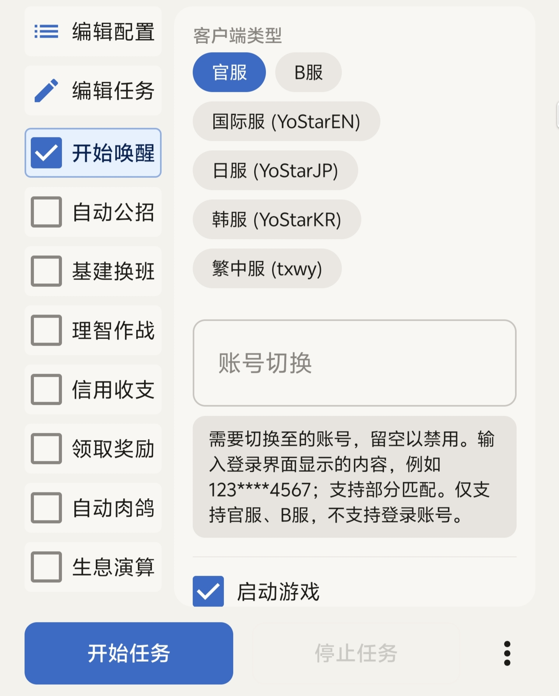

Startup is the foundation of everything MAA does. Without it nothing works: if the game isn't open, MAA has nothing to farm.

What it does: **launch the game → select the account → enter the game**.

Why does the game restart as soon as I tap Start task?

This is normal behavior. MAA will automatically launch the game and enter the main menu. You don't need to open Arknights yourself.

Failed to launch game

If Arknights needs an update, MAA will report an error and fail to launch. Make sure you have Arknights installed on your phone and it's up to date.

Account switching and server switching

Both are tied to the currently selected Startup task. Every time that Startup task runs, it switches account and server once.

## Auto Recruitment

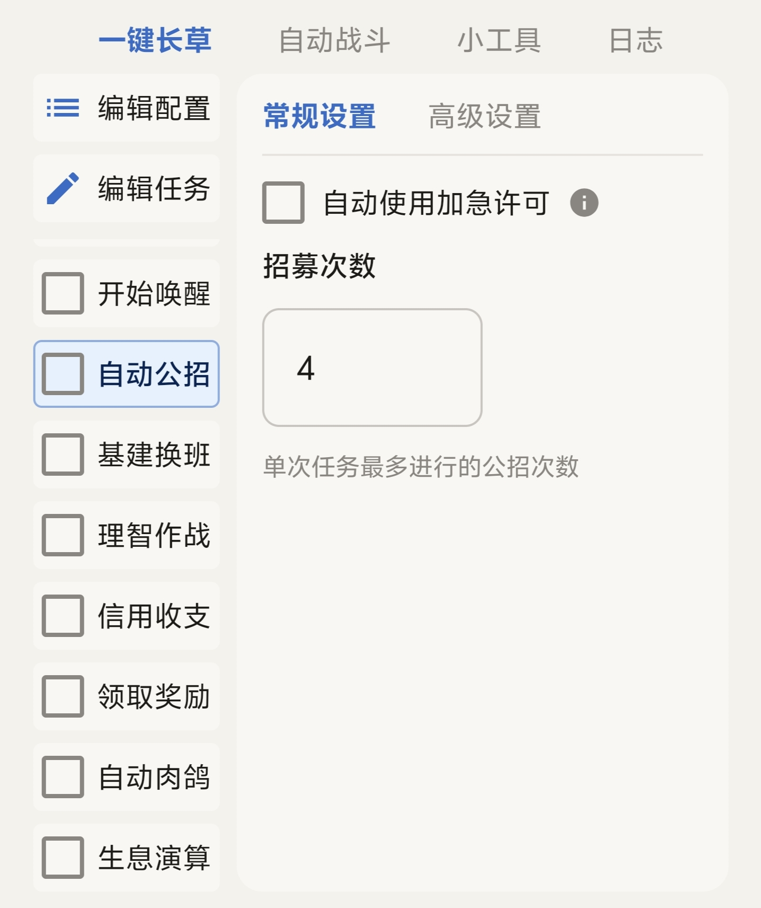

Supports automatically using Expedited Plans and setting the maximum number of recruitments per task run.

:::note
The **Auto use Expedited Plans** option won't be saved automatically. You need to check it again each time you run the task.
:::

## Base Management

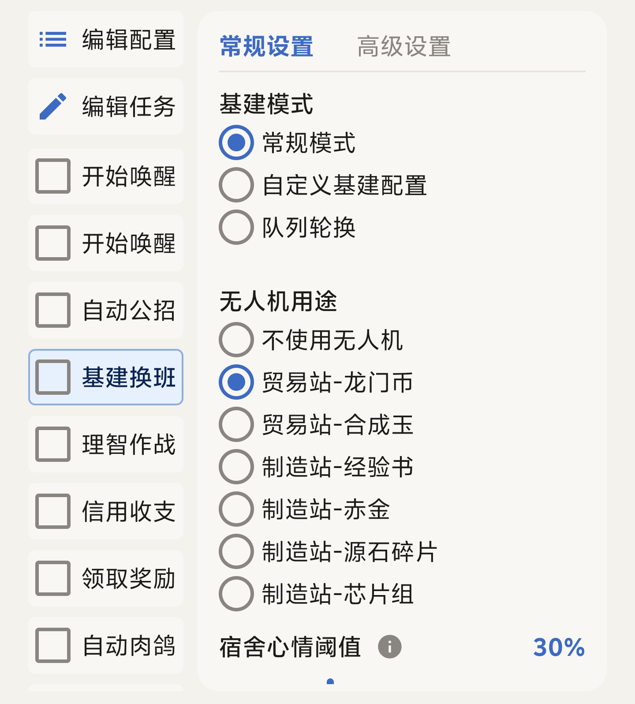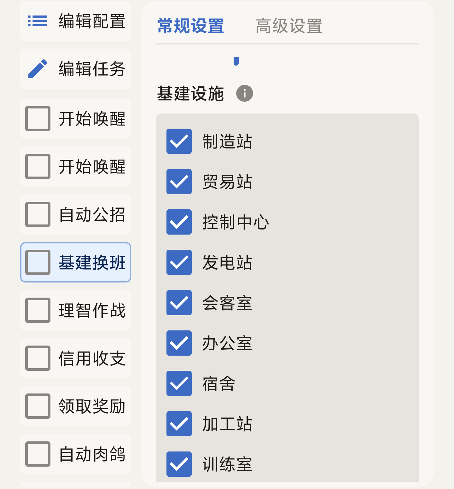

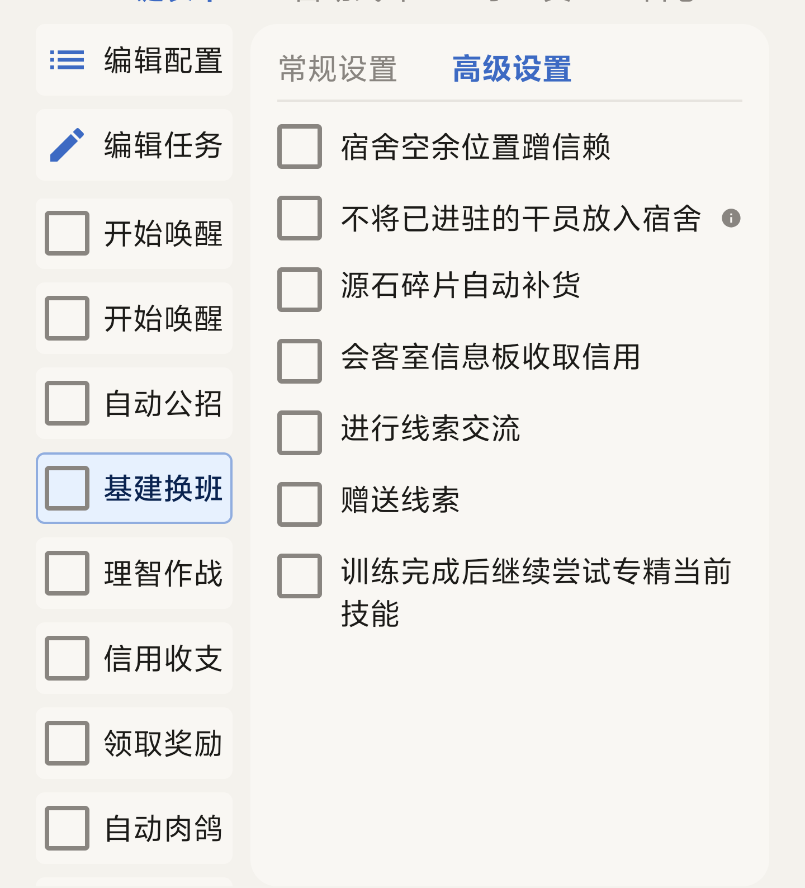

### Normal Mode

- Automatically calculates and selects the optimal solution within each facility, supporting all common skill types and special skill combinations.
- Automatically identifies EXP Records, Gold Bars, Originium Shards, and Chips, and uses corresponding operator combinations for each.
- Uses drones according to the method selected in **Drone Usage**.
- Automatically identifies morale progress, and places operators with remaining morale below the **Base Facility Morale Threshold** in the Dormitory.
- You can select which facility types you want MAA to handle; all are selected by default.
- Until the Reception Room has collected all the clues, MAA won't place clues on the clue board, and it removes any that are already there.

Why did MAA remove all clues from the clue board?

This is by design:

- When you don't have all 7 clues, MAA will remove all clues from the board and return them to storage during shift changes.
- When you have all 7 clues, MAA uses one-tap placement and starts the Clue Exchange.

This is because of two game rules:

- Personal clue total is capped at 10, including clues already on the board.
- Clues on the board don't count toward "duplicate clue" determination.

If you put many clues on the board early but can't complete the exchange, clue flow will get stuck. For example, if the board has 6 clues and you have 4 different clues in storage: the total reaches the cap, the Reception Room can't produce or receive new clues anymore; your storage has no duplicates, so one-tap gifting can't send anything. You can only wait for a friend to send you the missing one.

By returning all clues to storage, they all participate in duplicate detection, so one-tap gifting keeps working.

### Queue Mode

You need to set up preset queues in-game first. MaaMeow will automatically rotate them; the logic is the same as the in-game queue rotation. To customize the shift rotation, use Custom Base Mode.

### Custom Base Mode

Custom Base Mode has three steps: export operator data with MAA, generate a shift schedule on Yituliu, then import the schedule back into MAA. The entire process is done on your phone.

Yituliu supports two ways to import operator data:

- **Skland Token**: Yituliu has a complete guide on their site; we won't cover it here.
- **MAA JSON**: exported with **Operator Recognition** in MAA's Tools. The steps below use this method.

:::tip[Different systems, different interfaces]
The file save and selection interface varies by phone brand. We provide screenshots for Xiaomi, OPPO / OnePlus / realme, and vivo tablets below; choose the one that matches your device.
:::

#### Step 1: Export operator data with MAA

1. Check **Startup**, tap **Start task**, and wait for it to finish.
2. Switch to the **Tools** page, select **Operator Recognition**, and tap **Start task** again.
3. After recognition completes, tap **Export file** and select **JSON**.

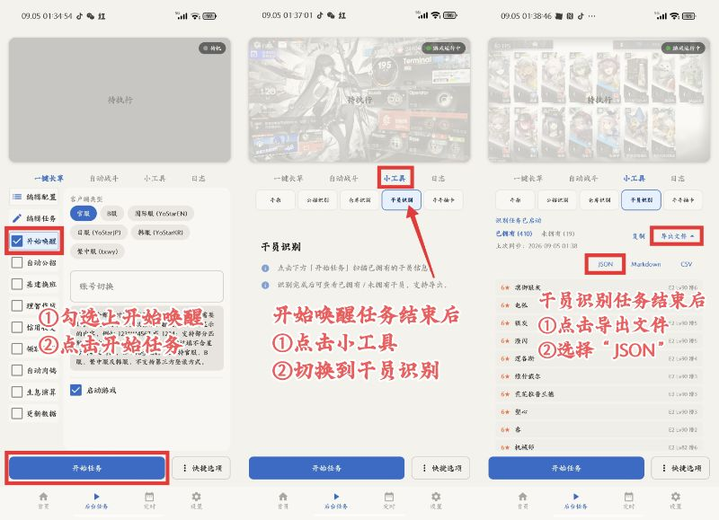

A system save dialog will appear. Save it to the default location. You can rename the file, but **do not remove the `.json` extension**.

Xiaomi interface

Just save it to the default **Downloads** folder. If you don't know what the path means, don't change it.

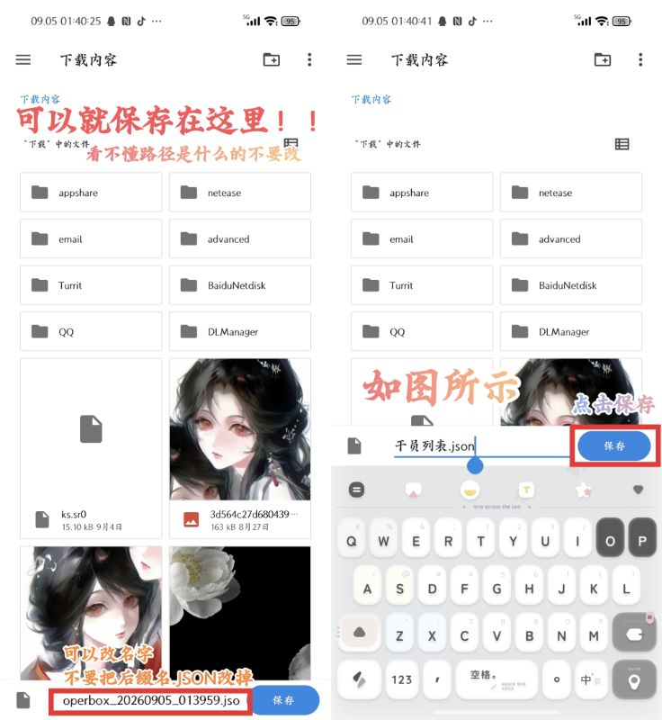

OPPO / OnePlus / realme interface

Tap **All files** and save it anywhere you can find again.

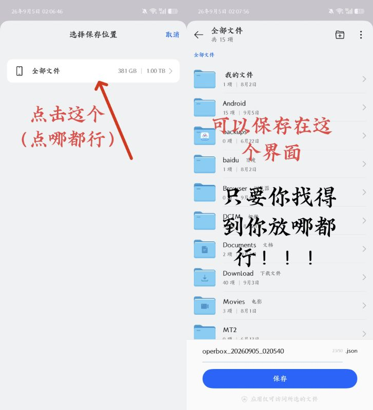

vivo tablet interface

Just tap **Save** at the bottom.

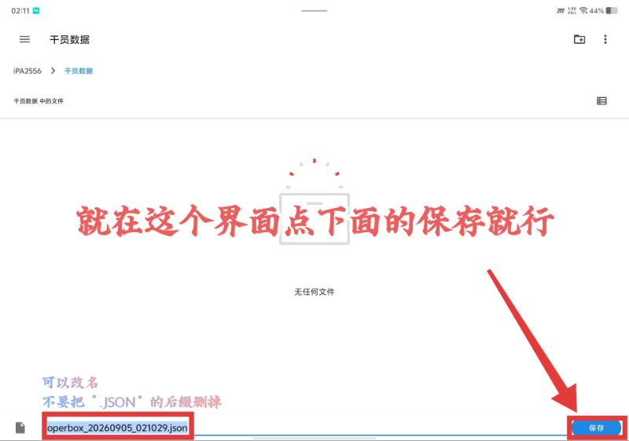

#### Step 2: Generate a shift schedule in Yituliu

1. Switch to **Farming** and tap **Base Management** in the task list on the left.
2. For the base mode, select **Custom base config**, then tap the blue **Custom base schedule maker** link below it. It opens the MAA docs site.
3. The first link on that docs page, **Visual schedule generator**, is the [Yituliu schedule generator](https://ark.yituliu.cn/tools/scheduleV3).

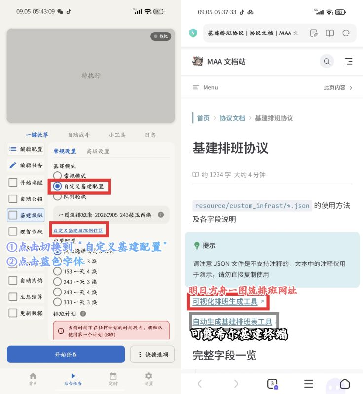

On the Yituliu page, tap **Add data source**, select **Import MAA JSON**, then find the file you just exported in the file manager and add it. If you didn't rename it, the file name starts with `operbox`. Settings such as **two shifts a day** are defaults; leave them alone.

Xiaomi interface

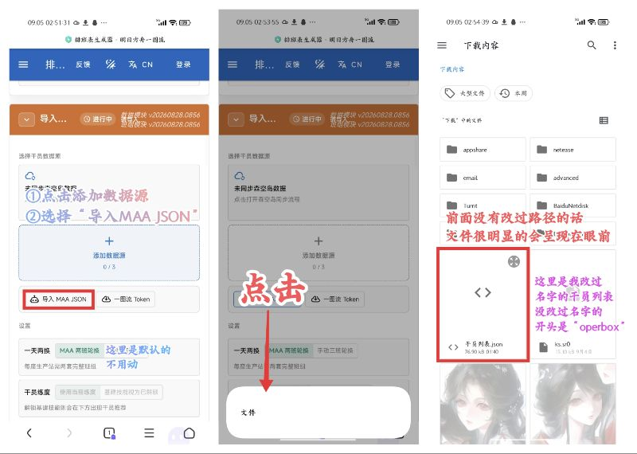

OPPO / OnePlus / realme interface

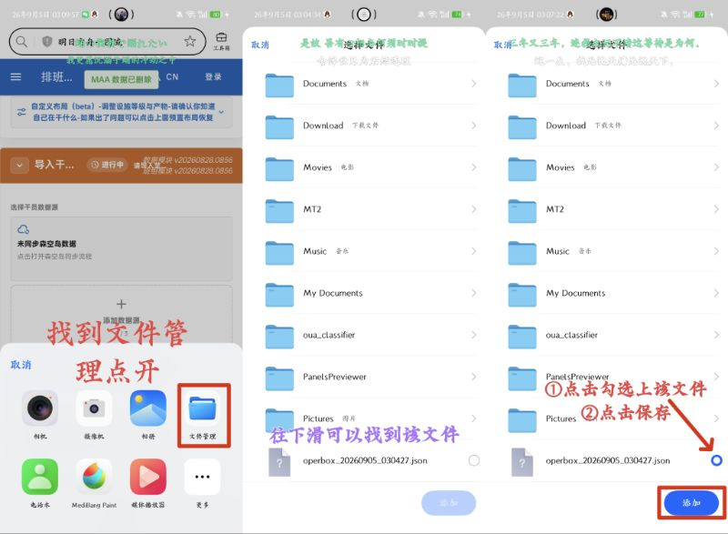

After the import, the page jumps to **Layout planning**. If it doesn't, scroll up yourself; please don't ask in the group why it didn't jump. Pick the production setup that matches your own base layout. You can change it directly while **Show background schedule** is on. The page may freeze for a moment: tap once and wait.

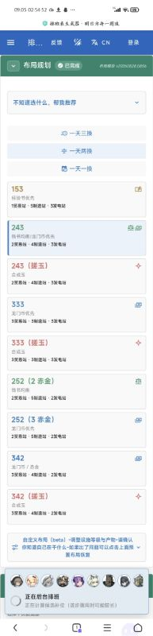

After the schedule is generated, tap **Export MAA schedule file** at the bottom right.

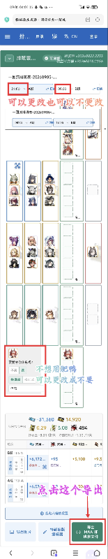

:::caution[Timing must match your scheduled tasks]
If you set up scheduled tasks, the shift change times in the schedule should match your scheduled tasks exactly. For example, if scheduled tasks are at 4:05 and 16:05, change the schedule to these same times. If you change the times, make sure they line up with your own scheduled tasks.
:::

#### Step 3: Import the shift schedule into MAA

Switch back to MaaMeow: tap **Base Management**, select **Custom base config**, then tap **Tap to select a custom file**.

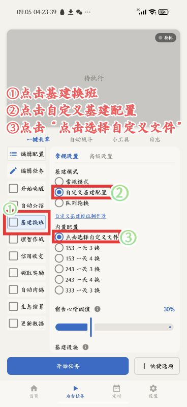

Find the file you exported in the system file picker. If you didn't rename it, the file name starts with `一图流`. Check it and tap OK to finish the import.

Xiaomi interface

Switch to **Browse**, open the DLManager folder inside Download, check the file, and tap OK.

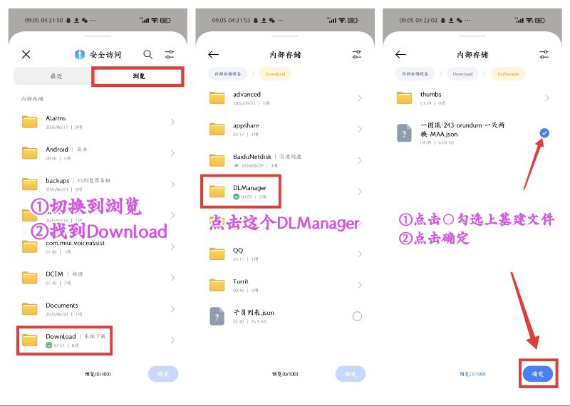

OPPO / OnePlus / realme interface

Switch to **Files**, tap **Download**, and tap the file to import it.

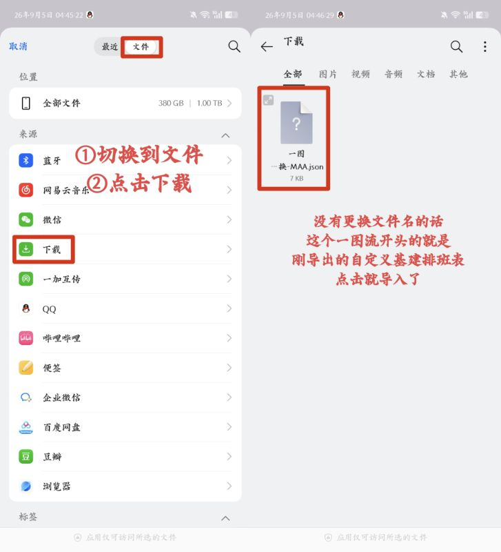

How does the schedule move to the next shift?

The shift will automatically switch to the next one after the Base Management task finishes. To switch on schedule, use [scheduled tasks](/en/faq/schedule/).

## Sanity Farming

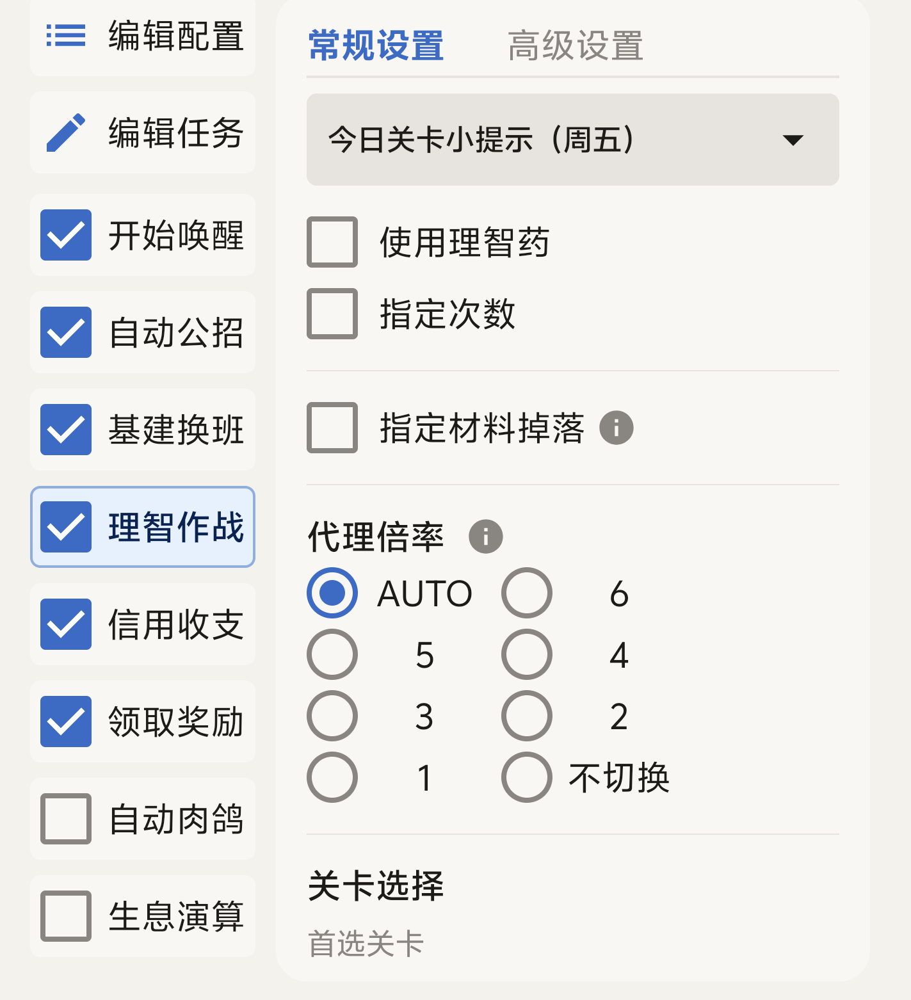

When **Use Sanity Potion**, **Perform Battles** and **Material** are all checked, the task stops as soon as any one of them is met. For daily use, check only one.

Auto-deploy multiplier

- **auto**: Automatically detects and maintains the maximum auto-deploy multiplier for the stage. Uses Sanity Potions without overflowing Sanity.
- **Don't switch**: leaves the in-game auto-deploy multiplier as it is.

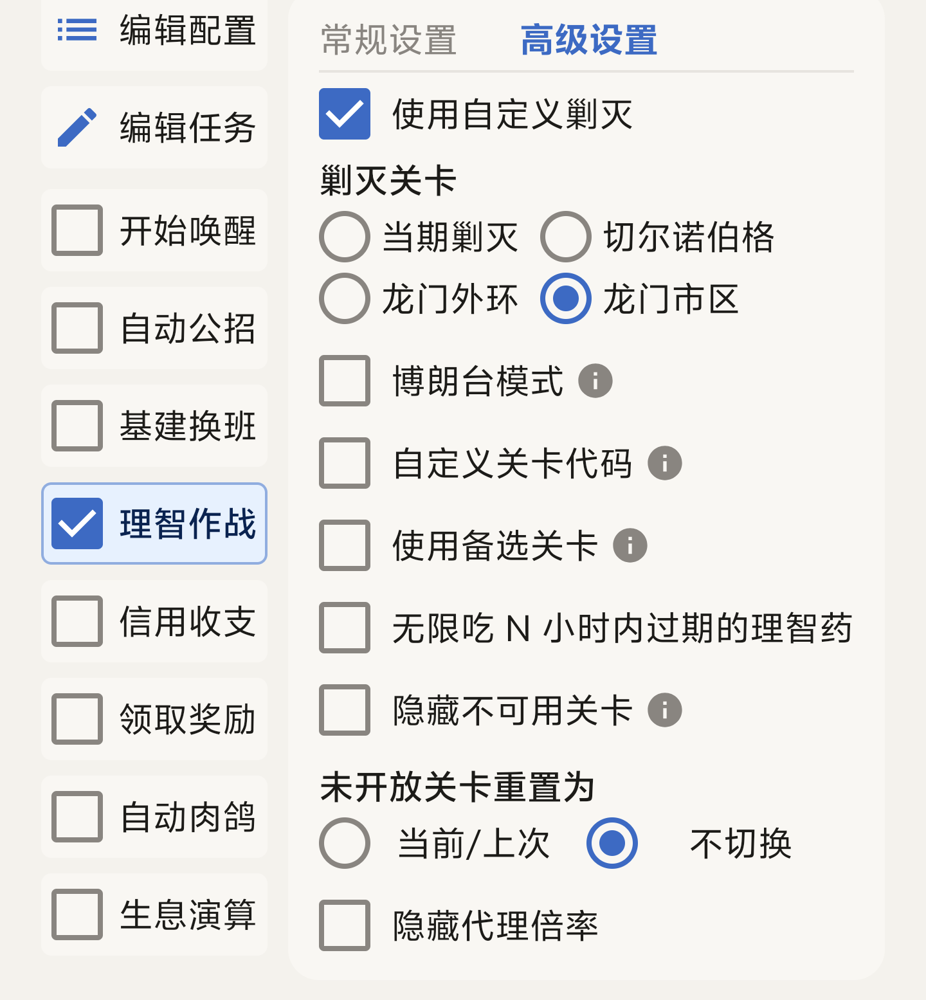

Custom Annihilation

When checked, you can select any one from the current Annihilation and three permanent ones (Lungmen Outskirts, Lungmen Downtown, Chernobog).

Alternate stage

In Normal Mode, you can select a preferred stage and alternate stages. Which alternate is used depends on what is open that day: MAA picks the first one that is open.

It works like a weekly timetable. **It is not a fallback for when a task fails.**

Dr. Grandet mode

Waits for Sanity to recover, then starts operations as Sanity is about to overflow. Doesn't take effect with infinite potion use.

The stage I want isn't in the stage selection

In MAA, select **Current/Last**, then navigate to the stage manually in the game. Leave the game on the stage details screen: stage name and remaining Sanity in the top right, **Auto Deploy** and **Start Operation** in the bottom right.

## Credit Store

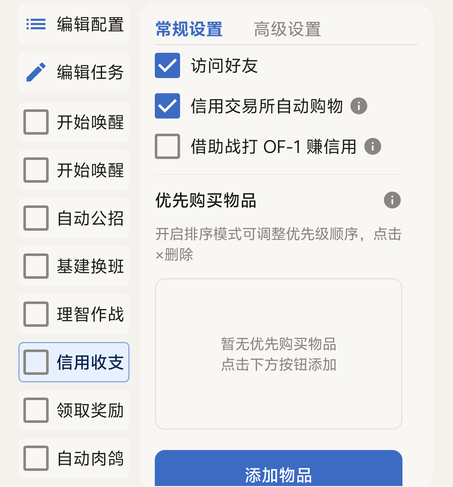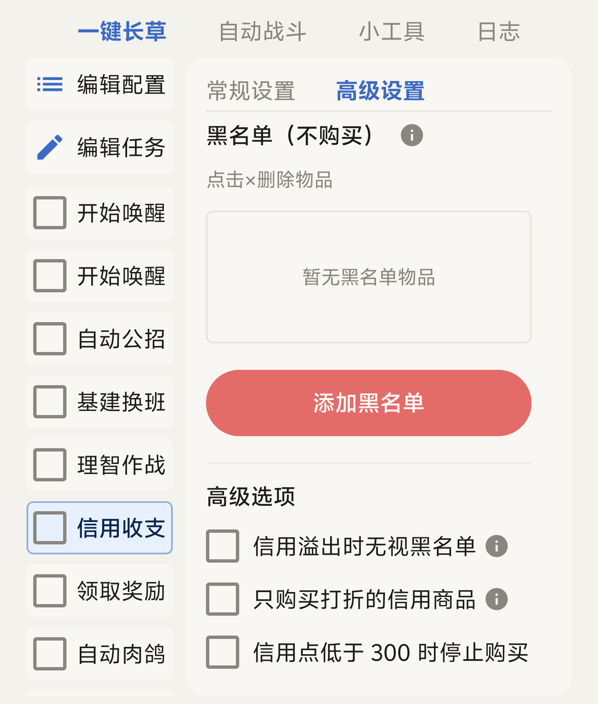

When checked, automatically visits friends to earn credits and then goes to the Credit Store to shop.

Earn credits by borrowing a support unit

MAA uses a support operator to clear Heart of Surging Flame OF-1 once. Make sure that stage is unlocked. This earns extra credits every day, but it uses up one of your friend support uses.

When stage selection is set to **Current/Last**, the borrow support unit task won't run.

Purchase priority and blacklist

Turn on sort mode to change the priority order; tap × to remove an item. Items in the priority list will be purchased in order. Items in the blacklist won't be purchased, unless credits overflow and forced purchase is enabled.

## Rewards

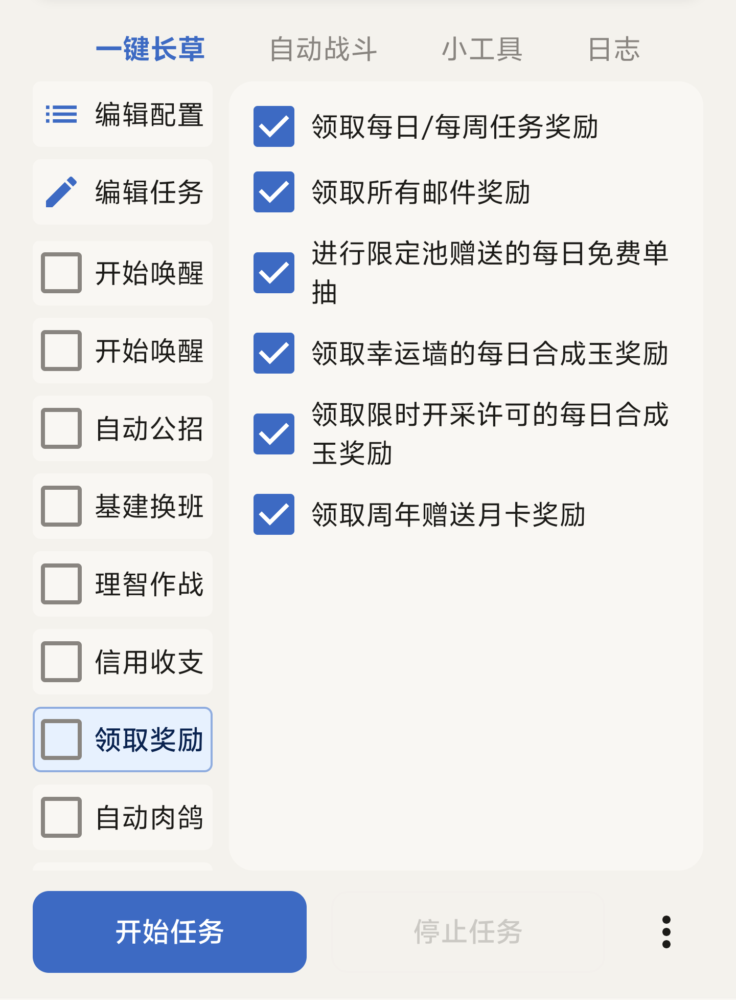

:::note
If after a version update MAA can't collect certain rewards, manually collect them and wait for an update.
:::
