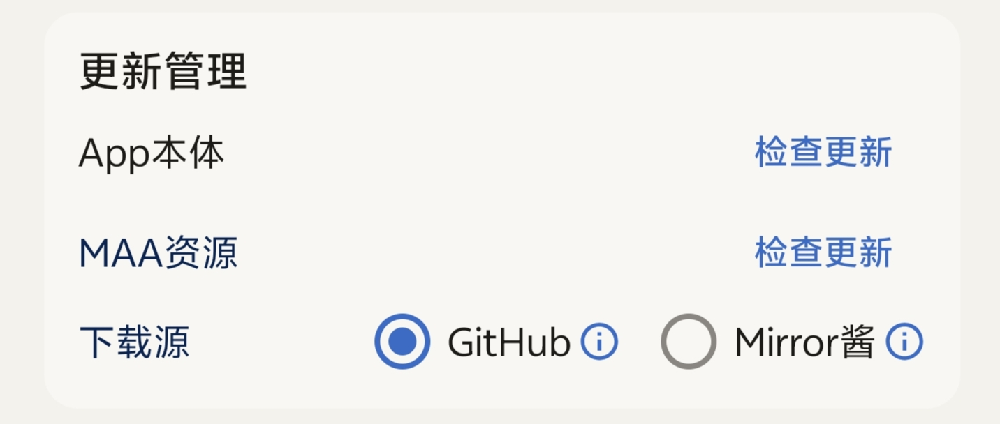
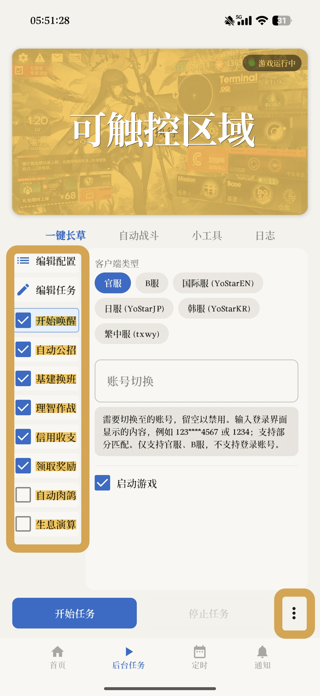
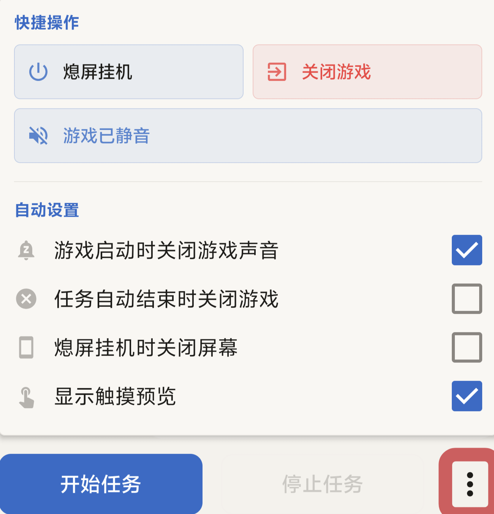

This guide covers only **background mode** and aims to get you up to speed with MaaMeow's basic operation in 15 minutes.

:::note[About this site]
MaaMeow is the Android port of MAA. This site covers only common issues and pitfalls specific to MaaMeow. For complete documentation of all task features, see the [official MAA docs](https://docs.maa.plus/en-us/manual/introduction/startup.html).
:::

## How it works

MaaMeow uses image recognition to run without a UI in a virtual display in the background. It does not inject code or modify game data, so it typically won't get your account banned.

:::caution[Check before you start]
- **Notch UI** will cause recognition errors. In-game, set notch adaptation to 0.
- **Eye comfort mode**, **power saving mode**, **game mode**, and **custom fonts** can change the display or resolution, preventing MAA from recognizing the screen. Turn them all off.
- **Scheduled tasks can't start from the lock screen by default.** Set up an unlock method first, see [Scheduled Tasks](/en/faq/schedule/#waking-from-the-lock-screen).
:::

Can I use foreground mode?

Yes, but it's not recommended. Problems reported in the QQ group include:

- App crashes while editing tasks.
- Task stops when you tap the floating ball.
- Resolution and touch position mismatches.

Background mode at full screen is close to foreground mode, though touch feedback may be slightly worse. Unless you're only doing a quick run, or a specific scenario requires you to watch the screen, foreground mode is strongly discouraged.

Can I use a cloud phone?

Cloud phones are more complicated:

- Don't prioritize using root to authorize Shizuku. Use Wireless debugging if you can.
- Compatibility is poor if the system version is too old or the aspect ratio is not the usual 16:9.
- If all else fails, fall back to foreground mode or try a different cloud phone provider.

For physical devices, prefer background mode. For cloud phones, check compatibility first.

## Downloads and updates

### Download MaaMeow

- **The community QQ group's shared files** (recommended): the MaaMeow package there is always the latest version. The group is Chinese-language. [Click to join the community group](https://join.maameow.com).
- **Download group**: QQ group 915168210.
- **GitHub**: Download the apk from [MAA-Meow Releases](https://github.com/Aliothmoon/MAA-Meow/releases). GitHub servers are mostly overseas, so direct connections may not always work.

After installation, you need to set up Shizuku to use MaaMeow. See [Installation and Authorization](/en/faq/setup/).

### Update the app and resources

The **Update management** option in settings lets you check for updates to the app and MAA resources separately. You can choose GitHub or MirrorChyan as your download source.

If a resource update prompt appears when you open the app, just tap Update. Old resources still work, but you may have issues with new events. We recommend staying up to date.

:::tip[Which download source to choose]
If you can access GitHub, use it directly and make sure your proxy allows MaaMeow. If your download speed is only a few KB, switch to MirrorChyan, a paid high-speed download service hosted in mainland China.
:::

There's an announcement pop-up every time I open the app

Reading the announcement is strongly recommended. If you don't want to see it again, wait five seconds, check **Don't remind me until the next announcement** in the bottom left, and tap Confirm.

## How to ask for help

The task failed. How do I ask for help so I get an answer?

1. Tap the gear icon in the top right to open settings and turn on **Debug mode**.
2. Reproduce the issue and record a video. You must reproduce it after turning on Debug mode.
3. In the log section of settings, tap **Export log archive**.
4. Share both the video and the log file.

Without Debug mode, the log won't have enough information to pinpoint the problem.

## Understanding the main screens

All yellow areas are touchable. The boxed area contains the function buttons.

## Edit tasks and edit config

Edit tasks

Tap **Edit tasks** to change a task's name. Tap **Add task** to add a task module.

**You must tap Confirm after editing**, or you won't be able to tap task modules to change their settings.

Edit config

You can freely combine the order of tasks. Tasks run from top to bottom. Press and hold a task module to drag and reorder it.

:::caution
If **Startup** is not at the top, the game can't be launched and the run fails with an error.
:::

