:::note
The new Reclamation Algorithm is still under development.
:::

:::caution[04:00 daily refresh]
Arknights briefly disconnects for its daily refresh at 04:00, which makes Reclamation Algorithm fail. MAA can't navigate to Relaunch Anchor automatically, so plan your unattended runs around it, or wait until Relaunch Anchor support improves.
:::

## Which stage to choose

| Stage | Efficiency | Stability | Best for |
| --- | --- | --- | --- |
| RA-4 | High | May hit small problems | People who can check on MaaMeow now and then |
| RA-15 | Slower | Rarely has problems | People who have no time to watch MaaMeow |

## The task keeps entering and leaving the screen

**Don't start** the Reclamation Algorithm task from this screen:

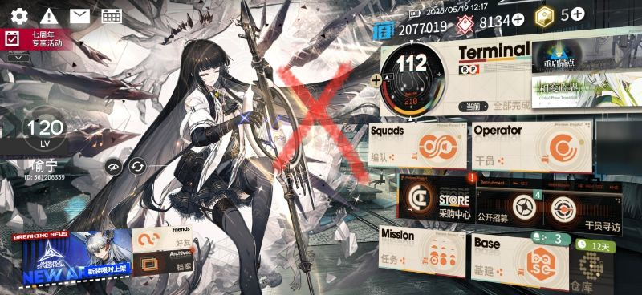

Go to the RA-1, RA-4 or RA-15 stage screen first, as shown below. The fourth image is the screen for the first season (Tales Within the Sand).

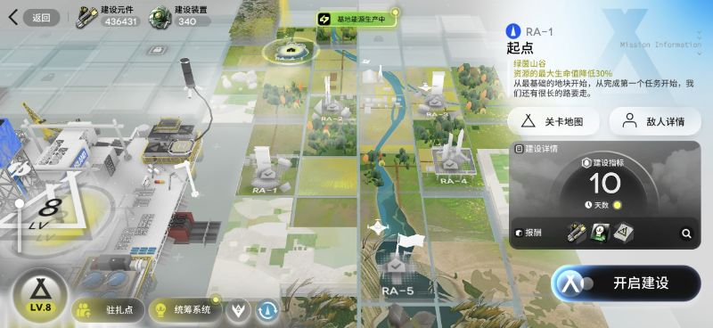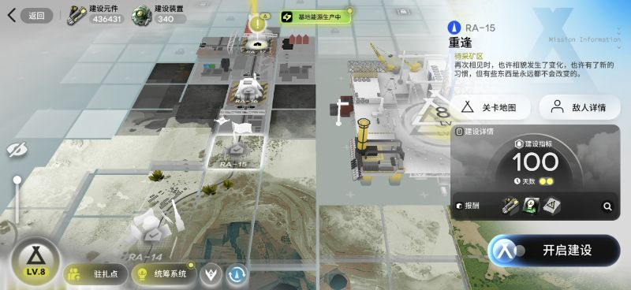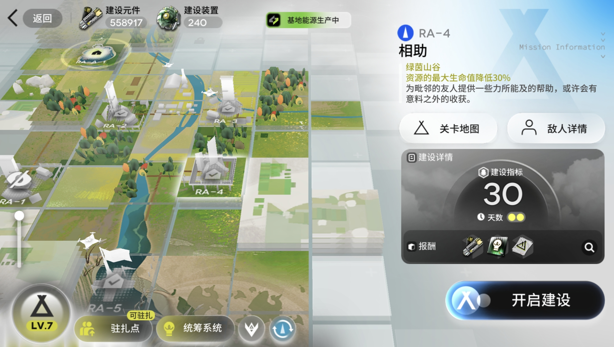

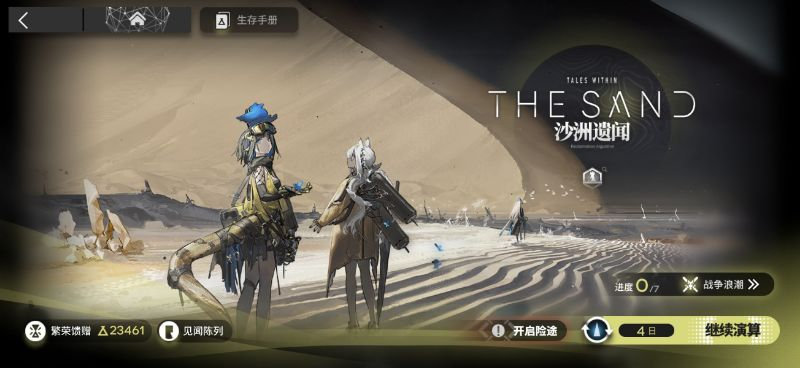

Read the notes for each stage carefully:

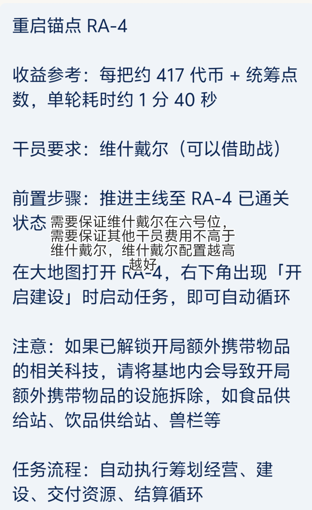

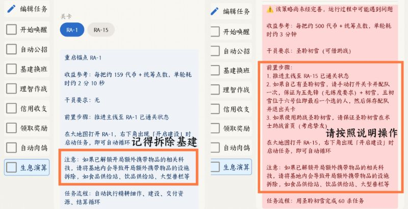

How do I tell whether the base facilities are demolished? (with a how-to)

If the squad screen shows extra items, the base facilities have not been demolished.

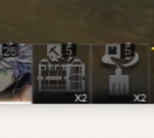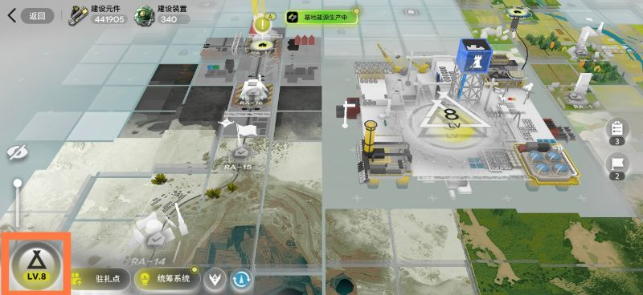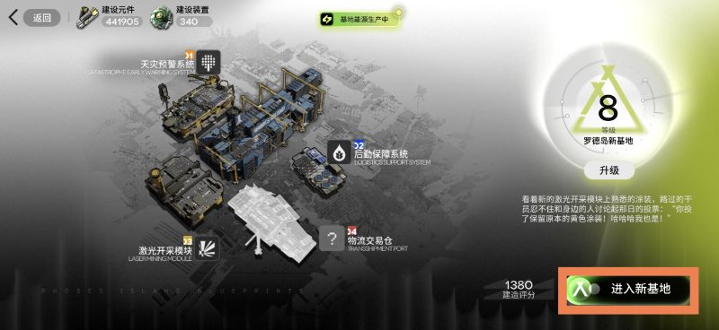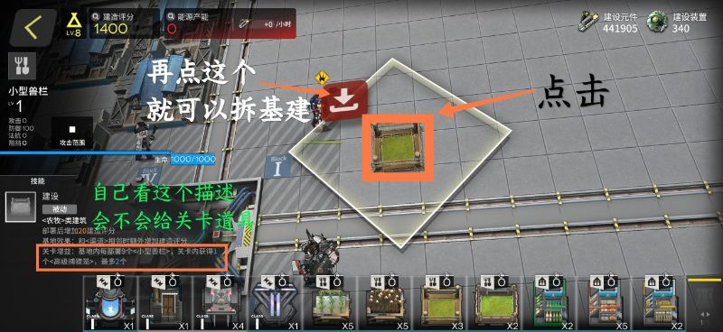

## Resolution and roster requirements

The following comes from the experience of some QQ group members. Please verify it yourself.

RA-1

Set the resolution to 720p.

RA-4

Set the resolution to 1080p and unlock Strategy Planning Management (the Gold squad).

- Wiš'adel must be in the 6th slot, and no other operator may cost more DP than Wiš'adel. The stronger your Wiš'adel, the better.
- If you borrow a support Wiš'adel, make sure she is on the first page of Sniper support units (a close friend's unit helps). Open the stage manually, add any 5 operators with a lower DP cost than Wiš'adel, pick the support Wiš'adel for the 6th slot, confirm recruitment, abandon the current construction, and start from **Start Construction**.
- Make sure the first five slots of the squad are filled and the 6th slot is empty.

RA-15

Set the resolution to 1080p, as shown here:

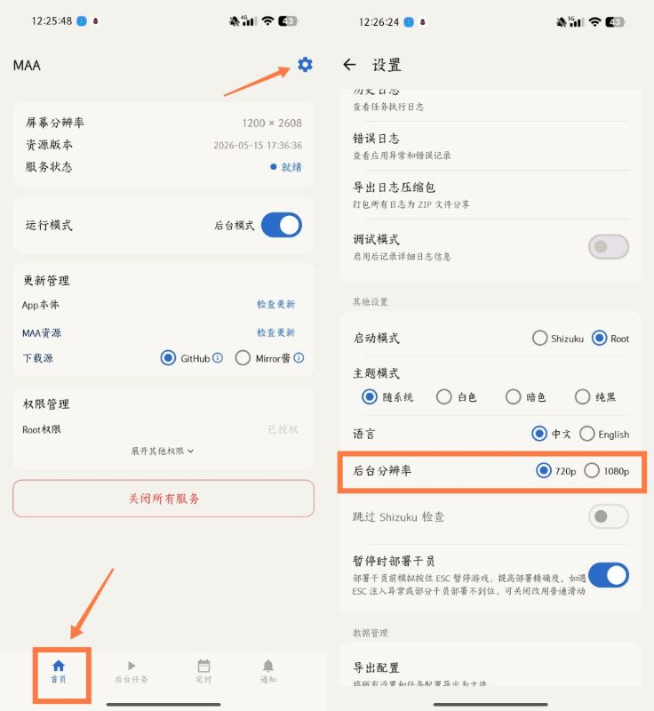

## Starting the task

Finally, check **Reclamation Algorithm** and start the task.

:::caution[Confirm before starting]
- The game is running and sitting on the screen for your stage.
- If a task is already running, tap **Stop task** first, then **Start task**.
:::

The first season fails as soon as I tap Start

Check whether the game has a save file while MAA is set to no-save mode. Tap the log and look for the message in red:

Can Reclamation Algorithm borrow support units?

The new Reclamation Algorithm can automatically borrow a support unit.

