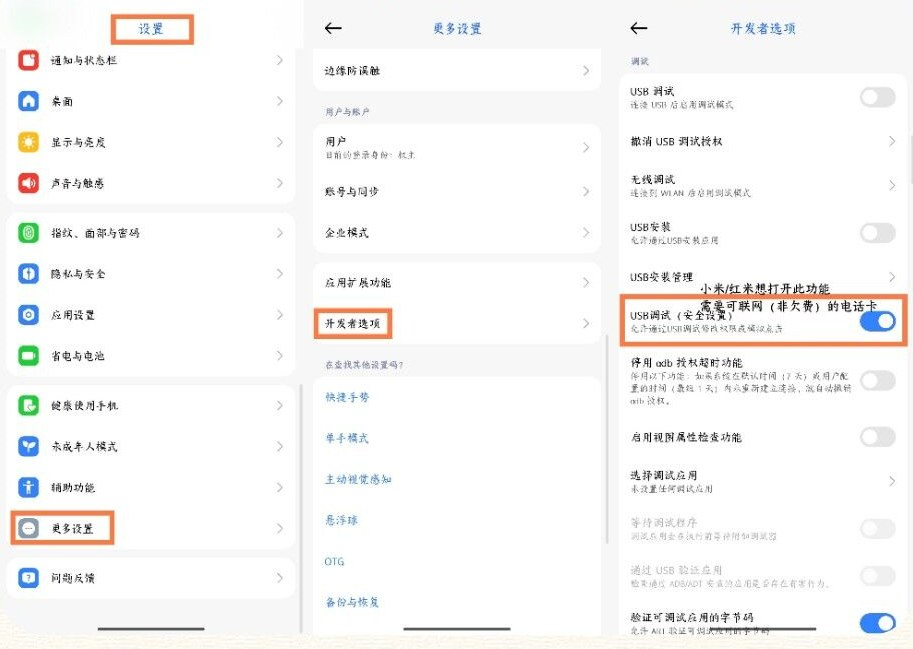
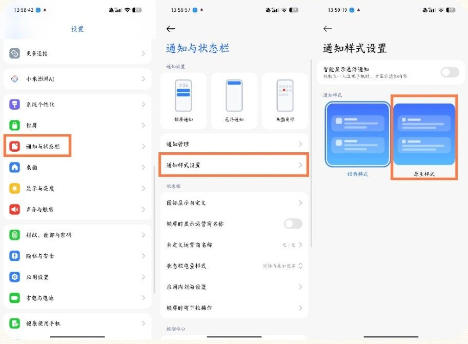
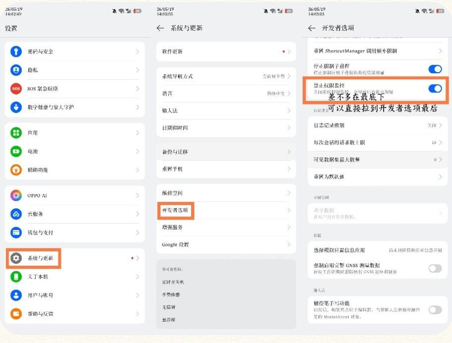

MaaMeow gets the permissions it needs to run through Shizuku. The process has four steps: download Shizuku, complete prerequisite settings, pair and start Shizuku, and authorize MaaMeow. See [Getting Started](/en/faq/getting-started/#download-maameow) for how to download MaaMeow.

## Download Shizuku

- **Included with MaaMeow** (recommended): Shizuku's installer comes bundled when you install MaaMeow.
- **Official channels**: Shizuku's official website or GitHub Releases.
- **The QQ group's shared files**: several versions are available there.

:::caution[Special devices]
- **MediaTek Dimensity processors** need a dedicated Shizuku version from the QQ group shared files.
- **Android versions below 11, or Android-based HarmonyOS**: Wireless debugging is not available. You need to connect to a computer and use the adb tool on the computer to run commands and get adb permissions.
:::

## Prerequisite settings

Complete the settings below before pairing. If you skip them, pairing and starting Shizuku will likely fail. To learn how to open Developer options, search Bilibili for a tutorial for your phone brand.

### All devices

1. In **Developer options**, enable **Disable adb authorization timeout**.
2. Enable Shizuku's notification permission, and confirm all permissions are on, including the pop-up (floating notification) permission.
3. In the recent apps list, pull down the Shizuku and MaaMeow cards to lock them, and enable **high background power usage** for both. MaaMeow also needs **autostart** permission.
4. Turn off power saving mode, eye comfort mode, and any other settings that change system resolution or screen appearance. MAA relies on screen captures to recognize the game, so these settings will affect accuracy.

### By brand

| Brand | Settings |
| --- | --- |
| Xiaomi / Redmi (MIUI, HyperOS) | 1. Enable **USB debugging (Security settings)**. This is a separate option from "USB debugging". You must have a SIM card inserted and be signed in to your Xiaomi account to turn it on.<br />2. Go to System settings → Notification management → Notification display settings, and change notification style to **Android (native) style**. For HyperOS 3, you can skip this step.<br />3. Do not use the **Security app** scan function, as it will disable Developer options. |
| OPPO / OnePlus (ColorOS), realme (realme UI) | 1. In **Developer options**, enable **Disable permission monitoring**.<br />2. On ColorOS 16.0.7 and later, this option is renamed to **Disable system optimization** and the toggle is hidden. See the steps below the table. |
| Huawei (EMUI, Android-based HarmonyOS) | In **Developer options**, enable **Allow ADB debugging in charge only mode**. HarmonyOS NEXT is not supported. |
| Meizu (Flyme) | In **Developer options**, disable **Flyme payment protection**. |
| Honor | Disable **Smart resolution** in resolution settings. |

<details class="faq">
<summary>Xiaomi / Redmi: Where is USB debugging (Security settings)</summary>

Go to Settings → More settings → Developer options, and find and enable **USB debugging (Security settings)**.



</details>

<details class="faq">
<summary>Xiaomi / Redmi: Switch to Android (native) notification style</summary>

Go to Settings → Notifications and status bar → Notification style settings, and select **Android (native) style**.



</details>

<details class="faq">
<summary>OPPO / OnePlus / realme: Where is Disable permission monitoring</summary>

Go to Settings → System and updates → Developer options, scroll near the bottom and find **Disable permission monitoring** and enable it.



</details>

<details class="faq">
<summary>ColorOS 16.0.7 and later: Can't find Disable permission monitoring</summary>

The new system renamed this option to **Disable system optimization**, and the toggle is hidden:

1. Switch the system language to English.
2. Open Developer options, scroll to the bottom, and find **Disable system optimization** above Autofill and enable it.
3. In the pop-up, tap the bottom button **Turn on anyway**; do not tap "Not now" above it.

After this, you can switch the system language back to Chinese. The toggle stays enabled.

</details>

## Pair Shizuku and authorize MaaMeow

### Step 1: Enter Wireless debugging

Open Shizuku and tap **Pair**. Follow the prompts to open Developer options and enter the **Wireless debugging** page.

Wireless debugging requires a WiFi connection. If you don't have WiFi, you can use a hotspot from another device. The hotspot doesn't need internet access.

### Step 2: Enter the pairing code

Tap **Pair device with pairing code**. Usually a pop-up will appear; long-press it to enter the pairing code. If no pop-up appears, pull down the notification panel, find Shizuku's notification, long-press it, and then enter the pairing code.

<details class="faq">
<summary>No pairing code input pop-up appears</summary>

- **Xiaomi HyperOS 3**: May not show the input pop-up. Long-press Shizuku's notification in the notification panel to enter the pairing code.
- **ColorOS / realme UI**: No pop-up or notification appears. Shizuku is most likely being restricted by the system's background management. Put Shizuku in a **floating window**, go back to Shizuku's initial screen, tap **Pair** again, and the pairing dialog will appear.
- **Other devices**: You can also try putting Shizuku in a floating window and tapping **Pair** again.

</details>

### Step 3: Start Shizuku

After entering the pairing code, tap OK. Once pairing succeeds, tap the notification to return to Shizuku, then tap **Start**.

Shizuku has started successfully when you see this line:

```text
Service started, this window will be automatically closed in 3 seconds
```

:::caution[Don't switch away while it starts]
You must stay on the start screen and wait until you see "Service started" before leaving. Leaving early will cause Shizuku to show as not running. See [Troubleshooting](/en/faq/troubleshooting/#shizuku-problems) for help.
:::

### Step 4: Authorize MaaMeow

On Shizuku's main screen, tap **Authorized 0 apps** and grant access to MaaMeow.

Go back to MaaMeow. If the service status on the home screen is normal, you're ready to start using it. If you see a service status error, follow [Troubleshooting](/en/faq/troubleshooting/#service-status-errors).
