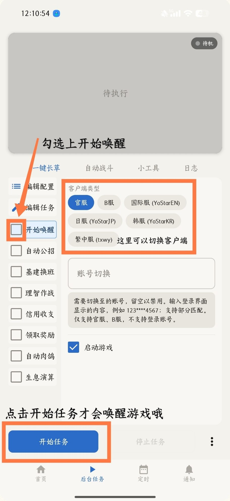
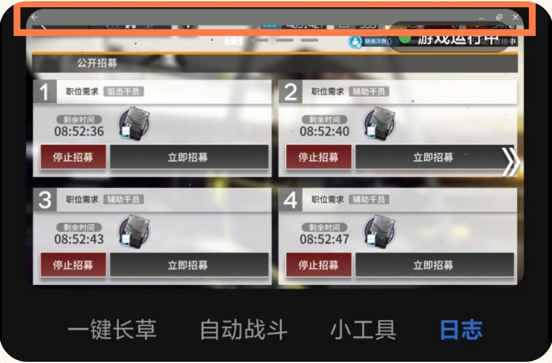
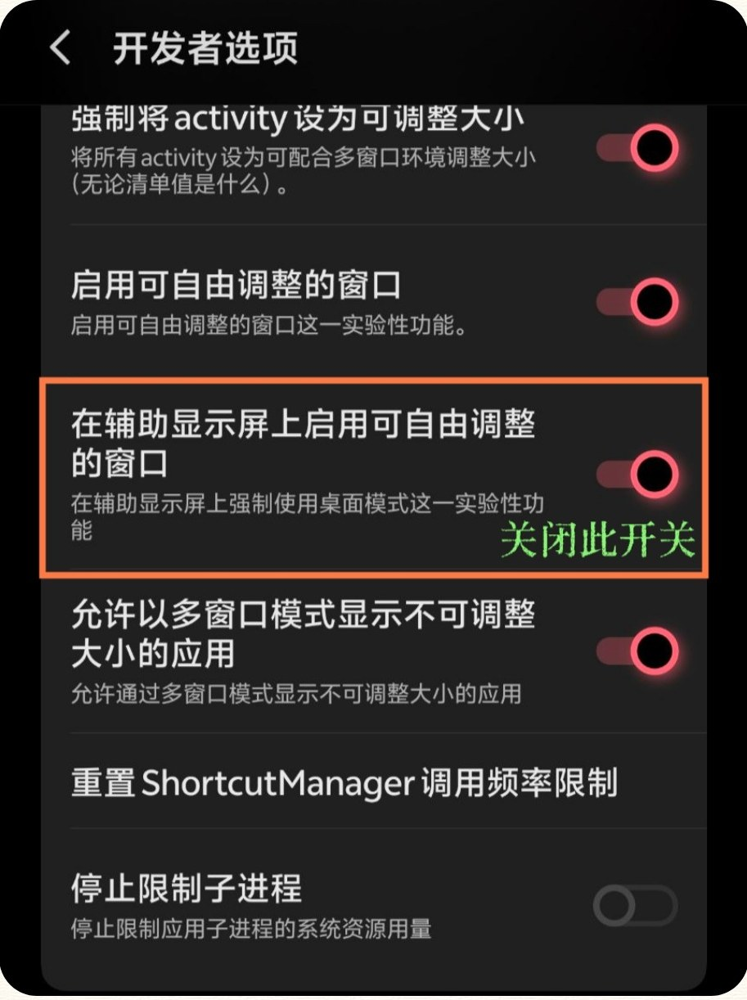
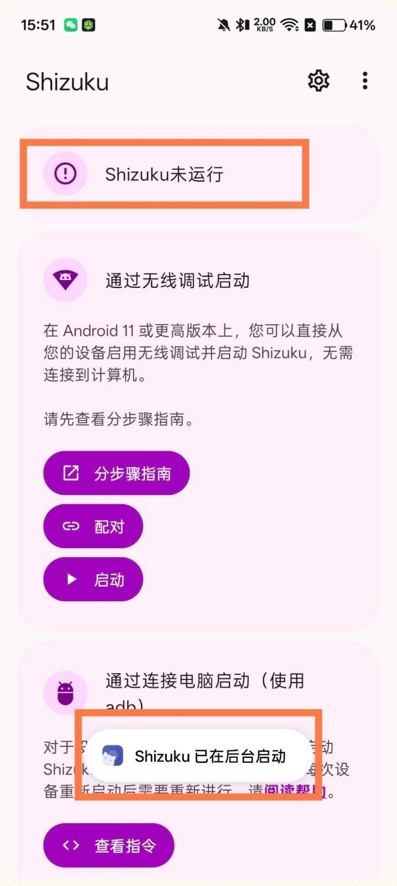
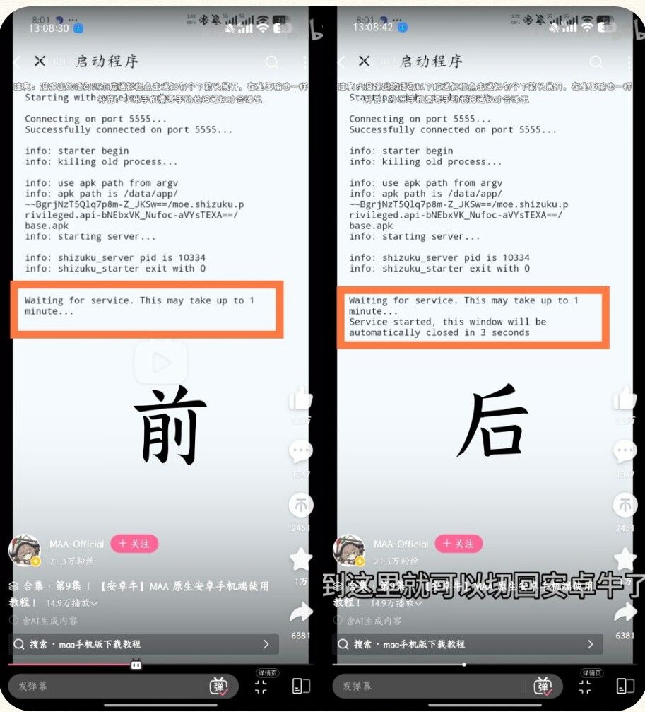

When something goes wrong, do three things first: update to the latest version, fully restart MaaMeow, and collect logs as described in [How to ask for help](/en/faq/getting-started/#how-to-ask-for-help). Below are the problems that come up most often in the QQ group.

## Service status errors

Check the service status on the home page after opening MaaMeow.

<details class="faq" open>
<summary>Service status shows "Service error"</summary>

Service errors are usually a Shizuku issue; only rarely is it a problem with MaaMeow itself.

**Go to Shizuku and re-authorize once.** About 60% of the time the authorization was simply lost. If the phone has just been restarted, having to re-authorize is normal.

If it still doesn't work after re-authorizing, continue checking:

- **Shizuku was started with root**: this has problems on Android 12, 13 and 14. Switch to Wireless debugging, or use MaaMeow's built-in root mode directly.
- **Root mode on Android 10**: has compatibility problems that won't be fixed soon. Use Shizuku with Wireless debugging instead.
- **Stuck on "Connecting to service"**: install the Shizuku package from the QQ group's shared files. Sometimes the Shizuku version is the cause.
- **Still not working**: tap **Stop all services** on the home page and try again. The last resort is to switch Shizuku versions and restart the phone.

</details>

<details class="faq">
<summary>Service status shows "Resource loading failed"</summary>

On the home page, tap **Stop all services**, then load the services again.

</details>

<details class="faq">
<summary>Service status shows "Task error"</summary>

This is an occasional display glitch. Background tasks still work normally, so you can ignore it.

</details>

## Screenshot failures

<details class="faq" open>
<summary>"Screenshot failed" is shown and the task won't run</summary>

Most of the time the game simply hasn't been woken up. Check **Startup** and tap **Start task**. The game is only launched once you tap Start task.

You can also switch **Client type** on this screen. Options are Official (CN), Bilibili, Global (YoStarEN), JP (YoStarJP), KR (YoStarKR), and Traditional Chinese (txwy). Make sure you select the server you're actually playing on.



</details>

## Black screen, tasks stop mid-run

<details class="faq" open>
<summary>The screen goes black mid-run, the task goes back to "Pending", or it pauses or exits right after entering a battle</summary>

Most of the time MaaMeow hasn't crashed; Arknights was killed in the background by the system. When the screen goes black, listen for the game's sound. If the sound is gone too, the game itself was killed.

The most effective method is to **lock Arknights in the recent apps list**: find Arknights in your recent apps, pull down its card or tap the lock icon. The exact place differs between phones, but almost all of them have it.

Also recommended:

1. Go to Shizuku and re-authorize once.
2. Close MaaMeow and open it again. Some phones occasionally get stuck, and reopening fixes it.

If the log contains errors such as `binder died`, this is no longer a simple configuration problem. Export the logs as described in [How to ask for help](/en/faq/getting-started/#how-to-ask-for-help) and ask for help.

</details>

<details class="faq">
<summary>Nothing happens after entering a stage, or "Failed to open the client" is shown</summary>

The startup order is usually wrong; see [Startup order](/en/faq/copilot/#startup-order) on the Auto Combat page.

</details>

## Stuck with an error after navigating to a page

<details class="faq">
<summary>Base Management or Sanity Farming reaches the right page, then stops and reports an error</summary>

Usually the resolution has changed, so the screen no longer matches what MAA expects:

- Check whether game mode, eye comfort mode or a similar feature that lowers the resolution is on. Turn it off and try again.
- In background mode, set **Background mode resolution** to 1080P in settings and try again.

</details>

## Screen display issues

<details class="faq" open>
<summary>A window title bar appears above the game picture in MAA</summary>

A bar like the one below appears because desktop mode in the system's Developer options treats the secondary display as a freeform window.



Open the system's **Developer options**, find **Enable freeform windows on secondary display**, and turn it off.



</details>

<details class="faq">
<summary>The background-mode window only shows half of the picture</summary>

Open the system's **Developer options**, find **Force desktop mode**, and turn it off.

</details>

## Touch problems

Different phone brands have different restrictions on background touch and ADB. First complete everything in [Prerequisite settings](/en/faq/setup/#prerequisite-settings): the settings for all brands and the ones for your own brand.

<details class="faq">
<summary>Touches drop or taps don't register during a run; old phones stutter</summary>

Old processors are prone to dropped touches, for example Snapdragon 870, 888 and anything older than Snapdragon 8 Gen 1. The 870 is the worst. Occasional dropped touches usually don't affect the task and can be ignored; otherwise use a newer device.

You don't need to lower the game's graphics quality. It improves neither performance nor dropped touches.

</details>

## Shizuku problems

:::tip[Watch the official video]
Search for **BV1reLp6GEeF** on Bilibili. It is MAA's official tutorial for native Android phones (in Chinese) and shows the whole Shizuku pairing process. The written version is in [Installation and Authorization](/en/faq/setup/#pair-shizuku-and-authorize-maameow).
:::

<details class="faq" open>
<summary>Shizuku says "started in the background" but still shows "not running", so MAA can't be authorized</summary>



In almost every case, after entering the pairing code and tapping Start, **you left the screen before Shizuku finished starting**, for example going back while it still showed `Waiting for service. This may take up to 1 minute...`. See 0:46 to 0:55 of the official video.

Fix: swipe Shizuku away from the recent apps list, open it again, and tap Start. **Stay on the start screen and wait** until "Service started" appears before switching back to MAA. If it still doesn't work, uninstall and reinstall, then pair again.



</details>

<details class="faq">
<summary>Stuck on "Waiting for service" for a long time with no response</summary>

You probably didn't set up the prerequisites correctly. Re-verify all settings from [Prerequisite settings](/en/faq/setup/#prerequisite-settings), then kill Shizuku in the background, open it again, and tap Start.

</details>

<details class="faq">
<summary>Startup log reports TimeoutException</summary>

Your log contains something like this:

```text
Waiting for service. This may take up to 1 minute...
java.util.concurrent.TimeoutException: Failed to receive binder within 1 minute
    at rikka.shizuku.Uv.a(SourceFile:95)
    ...
```

Try these in order:

1. Go through [Prerequisite settings](/en/faq/setup/#prerequisite-settings) again, then pair and start Shizuku again.
2. Try a different Shizuku version; the QQ group's shared files have several.
3. Restart your phone and try again.
4. Search "shizuku 解决错误" (Shizuku error solutions) on Bilibili for related videos and troubleshoot by comparison.
5. Send the screenshot to an AI (Doubao, DeepSeek, etc.) and ask what went wrong.
6. Ask in the QQ group, and please be polite. If group members can't solve it, ask an admin; a fix is not guaranteed.

</details>

## The game has no sound

<details class="faq">
<summary>After muting the game in MAA, the game is still silent when I open it myself</summary>

After you turn off game sound in MaaMeow, the game stays silent even when you leave MaaMeow and open Arknights by hand. A leftover mute state causes this. There are two fixes.

**Method 1: Reinstall Shizuku.** Uninstall Shizuku, reinstall it, and then pair and start it once. The sound comes back.

**Method 2: Use ADB commands to unmute.** You need adb on a computer or an ADB terminal app on your phone. First clear the global master mute:

```bash
adb shell cmd audio set-master-mute false
```

If you get an error saying `cmd audio` doesn't exist, try the legacy interface:

```bash
adb shell service call audio 21 i32 0
```

If there is still no sound, restart the system audio service. You don't need to reboot the phone:

```bash
adb shell killall audioserver
```

</details>

## Reclamation Algorithm won't run

This is covered on the [Reclamation Algorithm](/en/faq/reclamation/#the-task-keeps-entering-and-leaving-the-screen) page. In short: don't start the task from the main screen; navigate to the stage manually first.

## Nothing above helped

At this point the most useful thing is to bring the logs:

1. Turn on Debug mode in settings.
2. Reproduce the problem once.
3. Export the log archive in settings.

Then take the logs and a screen recording to the QQ group; see [How to ask for help](/en/faq/getting-started/#how-to-ask-for-help).
