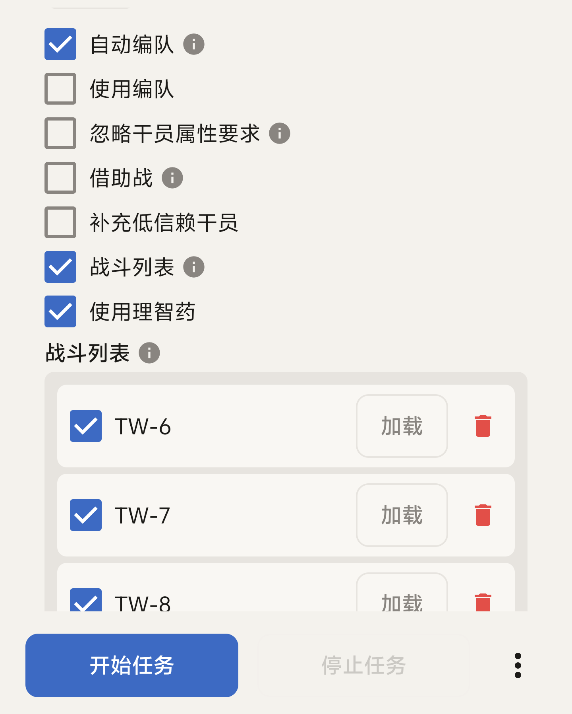

勾选「自动战斗」后会出现这些选项：使用编队、忽略干员属性要求、借助战、补充低信赖干员。勾选「战斗列表」后会出现使用理智药选项以及战斗列表。

## 注意事项

- 自动编队可能无法识别特别关注的干员。
- 忽略干员属性要求可能会导致战斗失败。
- 战斗列表不会自动清理，可能出现无法导航导致运行失败。
- 战斗列表长按标签可以拖动，调整自动战斗顺序。

## 各类关卡从哪里启动

:::tip
请确保战斗列表首位是需要战斗的关卡。
:::

主线、故事集、SideStory

在关卡界面右下角存在「开始行动」按钮的界面启动。

保全派驻

`resource/copilot` 文件夹内置多份作业。请先手动编队，在右下角存在「开始部署」按钮的界面启动，可配合「循环次数」。

悖论模拟

选好技能后，在技能选择界面存在「开始模拟」按钮的界面启动。1 星和 2 星干员没有技能，在右下角存在「开始模拟」按钮的界面开始。

若使用「战斗列表」，请从干员列表的「等级/稀有度」筛选下启动。

使用好友助战

请关闭「自动编队」和「战斗列表」，手动选择干员后，在编队界面右下角存在「开始行动」按钮的界面启动。

