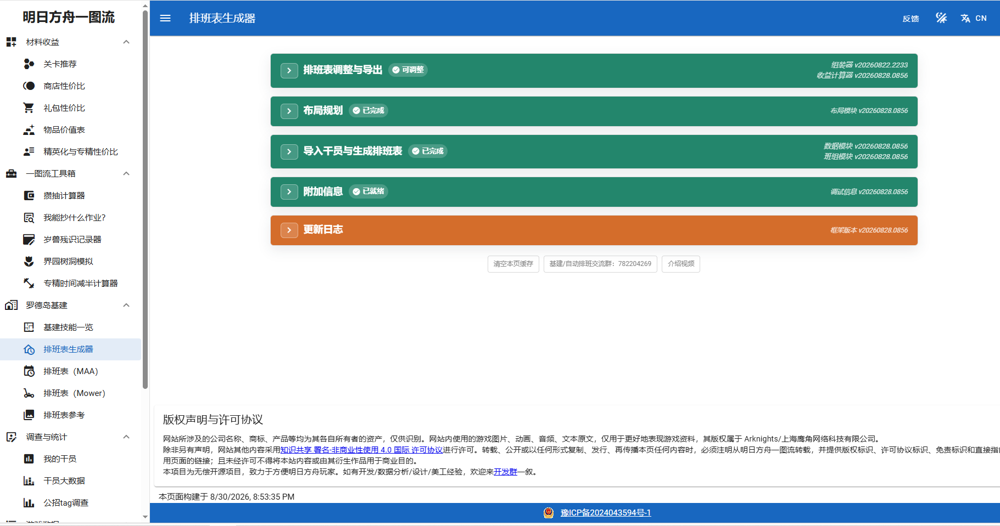

「一键长草」是日常挂机的核心。左侧任务模块的所有文字都可以点击打开任务设置，**勾选才是选中任务**。

## 开始唤醒

:::danger[账号切换栏不切换账号就不要填]
填了会卡死。
:::

开始唤醒是 MAA 最底层的逻辑，不勾选它什么都做不了：不打开游戏，牛牛怎么给你挂？

操作逻辑：**启动游戏 → 选择账号 → 开始游戏**。

为什么一点开始任务，游戏就重新打开了？

这是正常行为。MAA 会自动启动游戏并进入主界面，你不需要自己打开明日方舟本体。

提示无法启动游戏

如果明日方舟需要更新，MAA 会报错无法启动。请确保手机里有明日方舟，并且是最新版。

账号切换与服务器切换

两者都绑定在当前选定的「开始唤醒」上，每次执行开始唤醒任务时都会进行一次账号切换和服务器切换。

## 自动公招

支持自动使用加急许可，支持设置单次任务的最大招募次数。

:::note
「自动使用加急券」选项不会被自动保存，每次使用任务需要重新勾选。
:::

## 基建换班

### 常规模式

- 自动计算并选择单设施内的最优解，支持所有通用类技能和特殊技能组合。
- 自动识别经验书、赤金、源石碎片、芯片，分别使用相应的干员组合。
- 按照「无人机用途」中选择的方式使用无人机。
- 自动识别心情进度条，将剩余心情百分比小于「基建工作心情阈值」的干员进驻宿舍。
- 可自行选择需要 MAA 处理的设施类别，默认全选。
- 会客室线索未收集齐全时，MAA 不会把线索摆上线索板，以免污染线索池识别。

### 队列模式

需要先在游戏内设置好预设队列，MaaMeow 会自动轮换，逻辑和游戏内队列轮换相同。若要自定义轮换班次，请使用自定义基建换班。

### 自定义基建换班

怎样生成自定义基建文件？

「明日方舟一图流」网站支持根据 box 生成自定义基建文件，导入干员后按需调整即可。

可选的导入方式有两种：

- **森空岛 token**，一图流站内有完整指引。
- **MAA JSON**，使用 MAA 小工具中的「干员识别」功能导出文件到本地，再导入一图流网站。

怎样导入自定义基建文件？

基建换班 → 自定义基建配置 → 选择自定义文件 → 找到你在一图流导出的文件 → 勾选确定。

排班计划怎么切换班次？

班次在基建换班任务结束后会自动切换到下一班。如果要按时间切换，请配合定时启动功能。

## 理智作战

「使用理智药」「指定次数」「指定材料掉落」同时勾选时，满足任意一条就会结束自动战斗。日常建议只勾选其中之一。

代理倍率

- **auto**：自动识别关卡最大代理倍率并保持，使用理智药后理智不溢出。
- **不切换**：不调整游戏内代理倍率。

自定义剿灭

勾选后可在当期剿灭以及三个常驻剿灭（龙门外环、龙门市区、切尔诺贝利）中自选一个。

备用关卡

常规模式下可选择首选关卡和备用关卡。备用关卡按当天开放情况决定，即选择第一个开放的关卡。

这是一个类似日程表的功能，**不能当作任务失败时的备用关卡**。

博朗台模式

等待理智恢复后再开始行动，在理智即将溢出时开始作战。无限吃药时不生效。

关卡选择里没有我要的关卡

在 MAA 中选择「当前/上次」，然后在游戏里手动定位到关卡，确保画面停留在右上角有关卡名和剩余理智、右下角有「代理指挥」和「开始行动」的关卡详情界面。

## 信用收支

勾选后会自动访问好友获取信用点，并前往信用交易所购物。

借助战赚信用

MAA 会使用助战干员通关一次火蓝之心 OF-1，请确认该关卡已解锁。每日可获得额外信用点，但会消耗好友支援次数。

关卡选择为「当前/上次」时不会执行借助战任务。

购买优先级与黑名单

开启排序模式可调整优先级顺序，点击 × 删除。优先购买列表中的物品会按顺序优先购买。黑名单物品不会被购买，除非信用溢出且启用了强制购买。

## 领取奖励

:::note
如果版本更新后出现 MAA 无法领取的奖励，请手动领取并等待更新。
:::
