「一键长草」是日常挂机的核心。左侧任务模块的所有文字都可以点击打开任务设置，**勾选才是选中任务**。

## 开始唤醒

:::danger[账号切换栏不切换账号就不要填]
填了会卡死。
:::

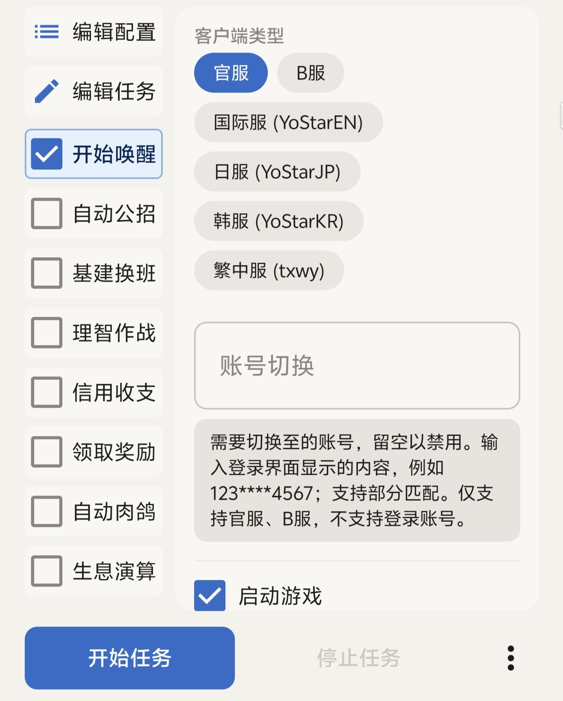

开始唤醒是 MAA 最底层的逻辑，不勾选它什么都做不了：不打开游戏，牛牛怎么给你挂？

操作逻辑：**启动游戏 → 选择账号 → 开始游戏**。

为什么一点开始任务，游戏就重新打开了？

这是正常行为。MAA 会自动启动游戏并进入主界面，你不需要自己打开明日方舟本体。

提示无法启动游戏

如果明日方舟需要更新，MAA 会报错无法启动。请确保手机里有明日方舟，并且是最新版。

账号切换与服务器切换

两者都绑定在当前选定的「开始唤醒」上，每次执行开始唤醒任务时都会进行一次账号切换和服务器切换。

## 自动公招

支持自动使用加急许可，支持设置单次任务的最大招募次数。

:::note
「自动使用加急券」选项不会被自动保存，每次使用任务需要重新勾选。
:::

## 基建换班

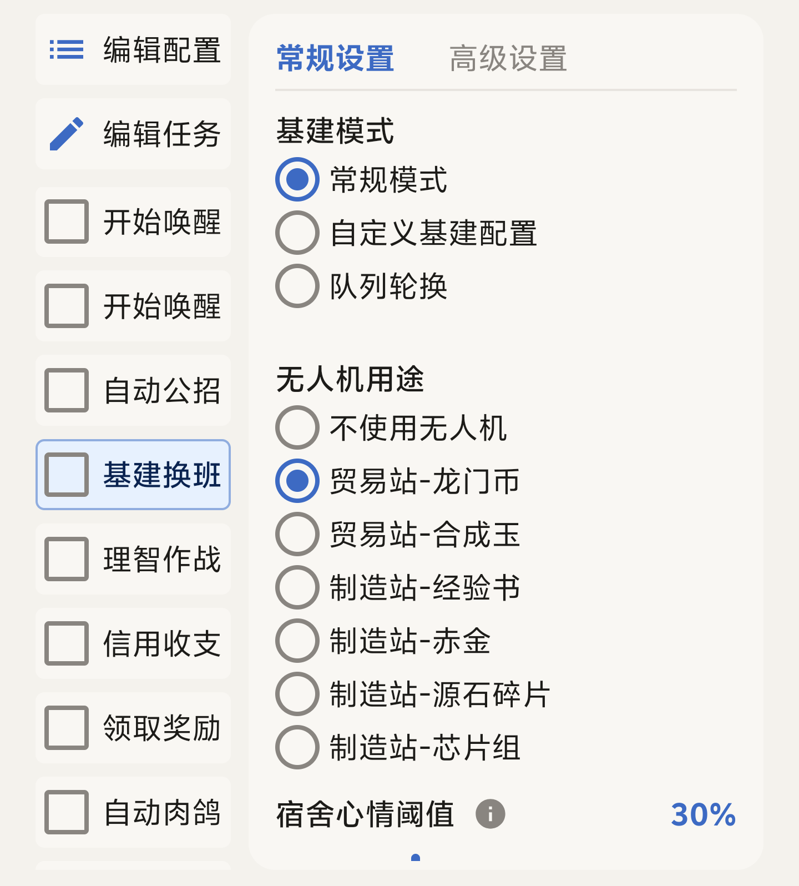

### 常规模式

- 自动计算并选择单设施内的最优解，支持所有通用类技能和特殊技能组合。
- 自动识别经验书、赤金、源石碎片、芯片，分别使用相应的干员组合。
- 按照「无人机用途」中选择的方式使用无人机。
- 自动识别心情进度条，将剩余心情百分比小于「基建工作心情阈值」的干员进驻宿舍。
- 可自行选择需要 MAA 处理的设施类别，默认全选。
- 会客室线索未收集齐全时，MAA 不会把线索摆上线索板，以免污染线索池识别。

### 队列模式

需要先在游戏内设置好预设队列，MaaMeow 会自动轮换，逻辑和游戏内队列轮换相同。若要自定义轮换班次，请使用自定义基建换班。

### 自定义基建换班

自定义基建换班分三步：先用 MAA 导出干员数据，再到「明日方舟一图流」生成排班表，最后把排班表导入 MAA。整个流程都在手机上完成。

一图流支持两种导入干员数据的方式：

- **森空岛 Token**，一图流站内有完整指引，本文不展开。
- **MAA JSON**，使用 MAA 小工具中的「干员识别」功能导出，下面按这种方式讲。

:::tip[系统不同，界面不同]
文件保存和选择的界面因手机品牌而异，下文分别给出小米、OPPO / 一加 / 真我、vivo 平板的截图，选你对应的看即可。
:::

#### 第一步：用 MAA 导出干员数据

1. 勾选「开始唤醒」，点击「开始任务」，等任务结束。
2. 切换到「小工具」页，选择「干员识别」，再点一次「开始任务」。
3. 识别结束后点击「导出文件」，选择 **JSON**。

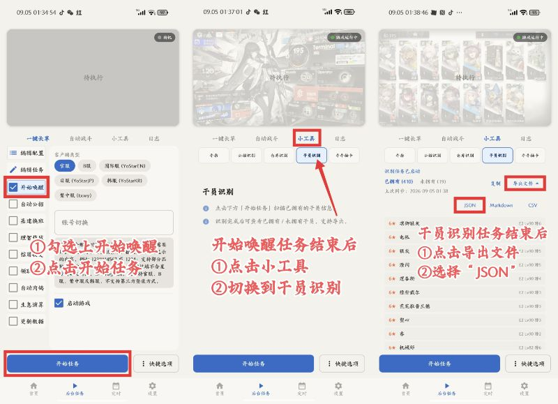

导出时会弹出系统的保存界面，直接保存在默认位置即可。文件名可以改，但 **不要把 `.json` 后缀删掉**。

小米显示的界面

保存在默认的「下载内容」里就行，看不懂路径是什么的不要改。

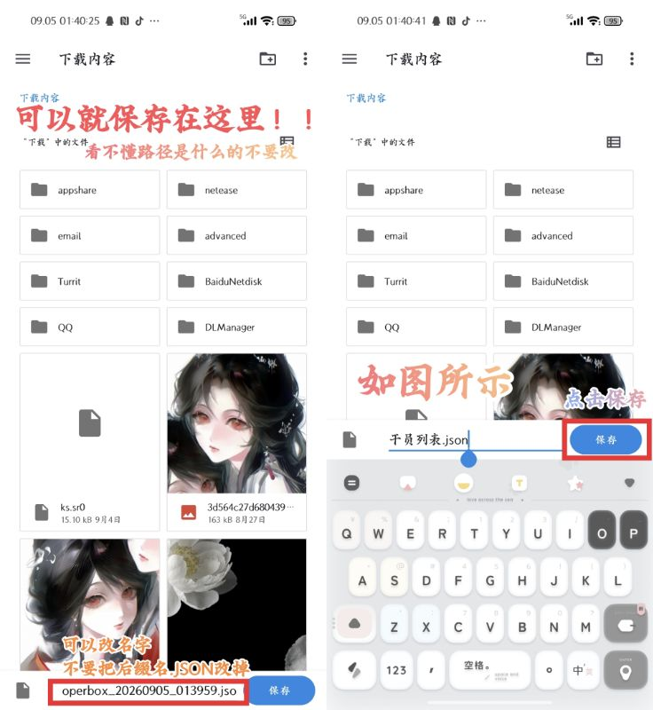

OPPO / 一加 / 真我显示的界面

点「全部文件」，随便选一个能找得到的位置保存。

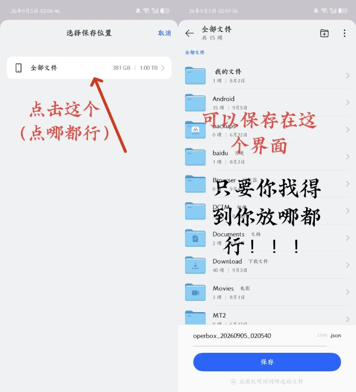

vivo 平板显示的界面

直接点下面的「保存」。

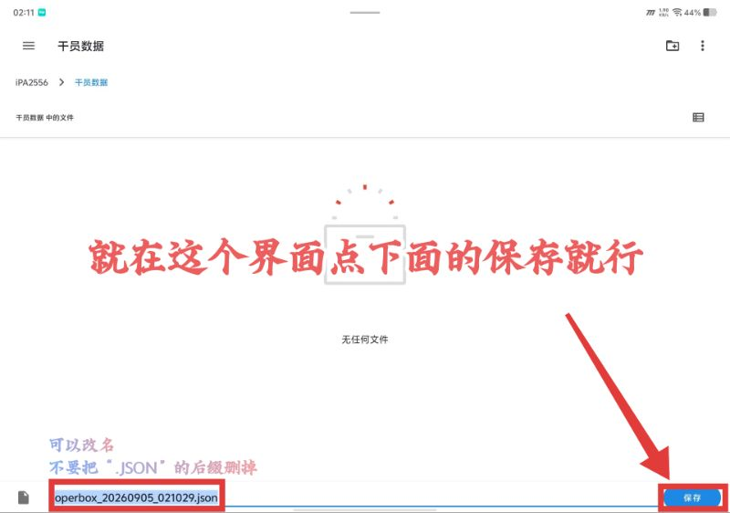

#### 第二步：在一图流生成排班表

1. 切换到「一键长草」，点击左侧任务栏的「基建换班」。
2. 基建模式选「自定义基建配置」，点击下方蓝色的「自定义基建排班制作器」链接，会跳到 MAA 文档站。
3. 文档页里第一个链接「可视化排班生成工具」就是 [明日方舟一图流排班生成器](https://ark.yituliu.cn/tools/schedule)。

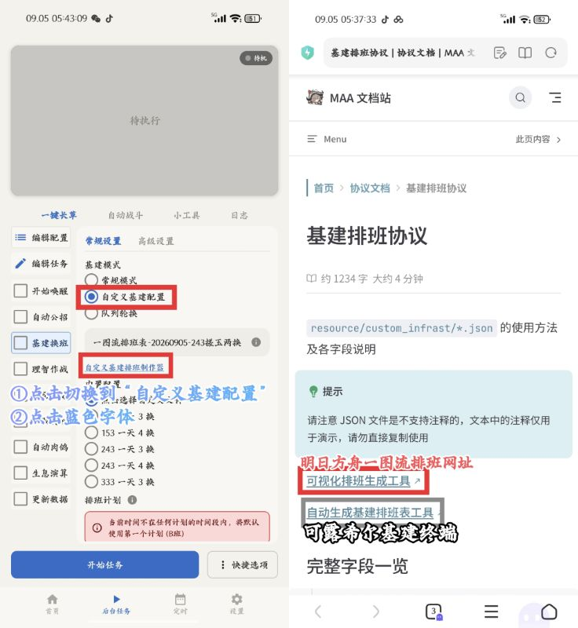

在一图流页面点击「添加数据源」，选择「导入 MAA JSON」，从文件管理里找到刚才导出的文件并添加。文件名没改过的话以 `operbox` 开头。「一天两换」等设置是默认的，不用动。

小米显示的界面

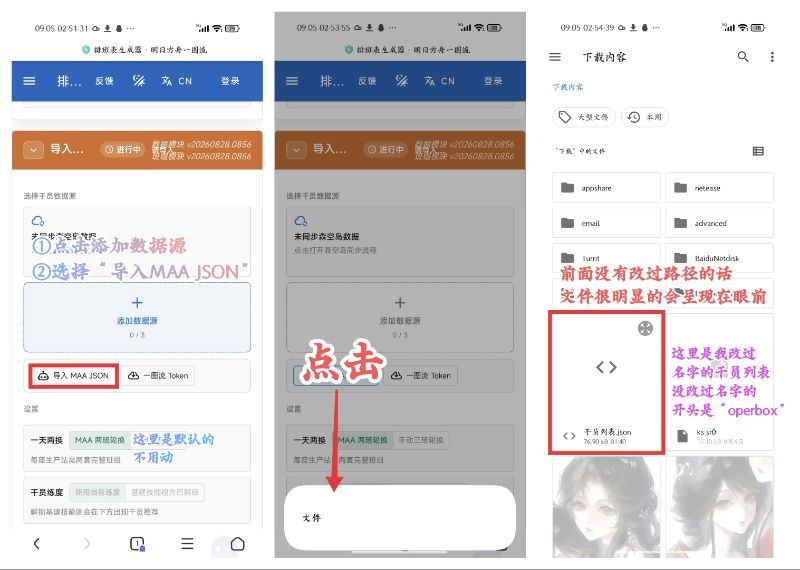

OPPO / 一加 / 真我显示的界面

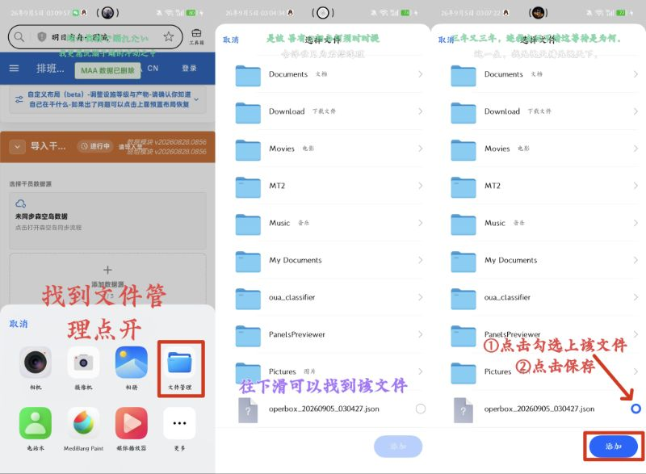

导入完成后会跳到「布局规划」界面。没跳转就自己往上划，不要在群里问为什么没跳转。按照自己的基建布局选择想要的生产方式，「显示后台排班」的时候可以直接更改。可能会卡一下，点一次之后等待就行。

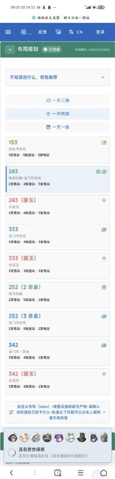

等排班生成好后，点击右下角的「导出 MAA 排班文件」。

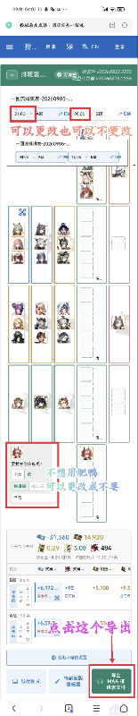

:::caution[时间要和定时任务一致]
如果你设置了定时任务，排班表里的换班时间最好改成和定时任务一模一样。比如定时任务在 4:05 和 16:05，就把排班表也改成这两个时间。改了时间的请一定要配合自己的定时任务。
:::

#### 第三步：把排班表导入 MAA

切回 MaaMeow：点击「基建换班」，选择「自定义基建配置」，再点「点击选择自定义文件」。

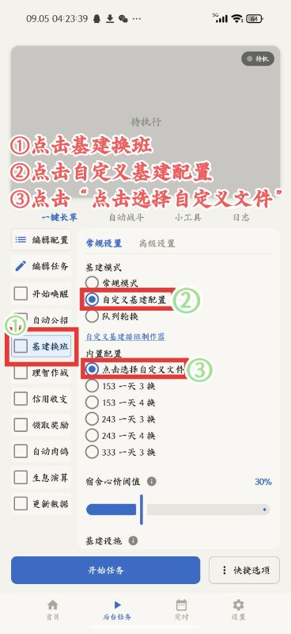

在系统文件选择器里找到刚才导出的文件。没改过文件名的话，以「一图流」开头的就是。勾选后点确定即导入完成。

小米显示的界面

切换到「浏览」，找到 Download 里的 DLManager 文件夹，勾选文件后点确定。

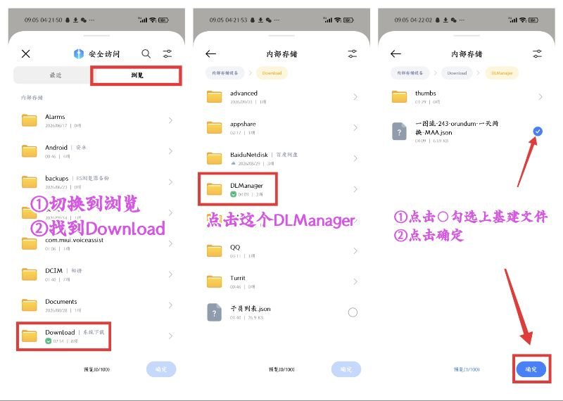

OPPO / 一加 / 真我显示的界面

切换到「文件」，点「下载」，点击文件即可导入。

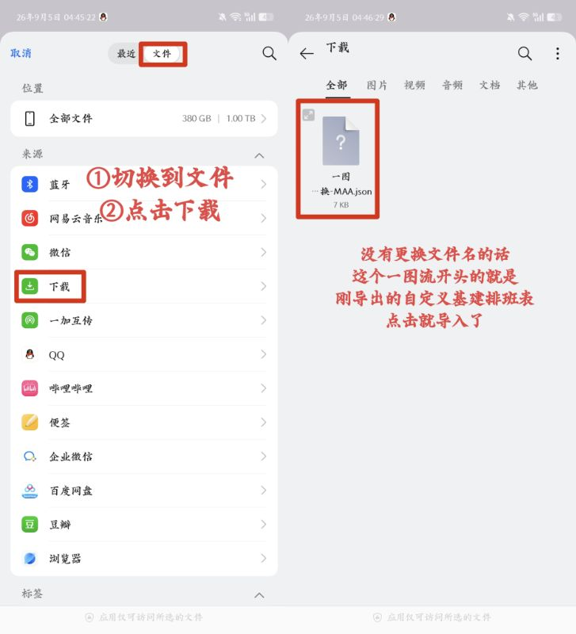

排班计划怎么切换班次？

班次在基建换班任务结束后会自动切换到下一班。如果要按时间切换，请配合定时启动功能。

## 理智作战

「使用理智药」「指定次数」「指定材料掉落」同时勾选时，满足任意一条就会结束自动战斗。日常建议只勾选其中之一。

代理倍率

- **auto**：自动识别关卡最大代理倍率并保持，使用理智药后理智不溢出。
- **不切换**：不调整游戏内代理倍率。

自定义剿灭

勾选后可在当期剿灭以及三个常驻剿灭（龙门外环、龙门市区、切尔诺贝利）中自选一个。

备用关卡

常规模式下可选择首选关卡和备用关卡。备用关卡按当天开放情况决定，即选择第一个开放的关卡。

这是一个类似日程表的功能，**不能当作任务失败时的备用关卡**。

博朗台模式

等待理智恢复后再开始行动，在理智即将溢出时开始作战。无限吃药时不生效。

关卡选择里没有我要的关卡

在 MAA 中选择「当前/上次」，然后在游戏里手动定位到关卡，确保画面停留在右上角有关卡名和剩余理智、右下角有「代理指挥」和「开始行动」的关卡详情界面。

## 信用收支

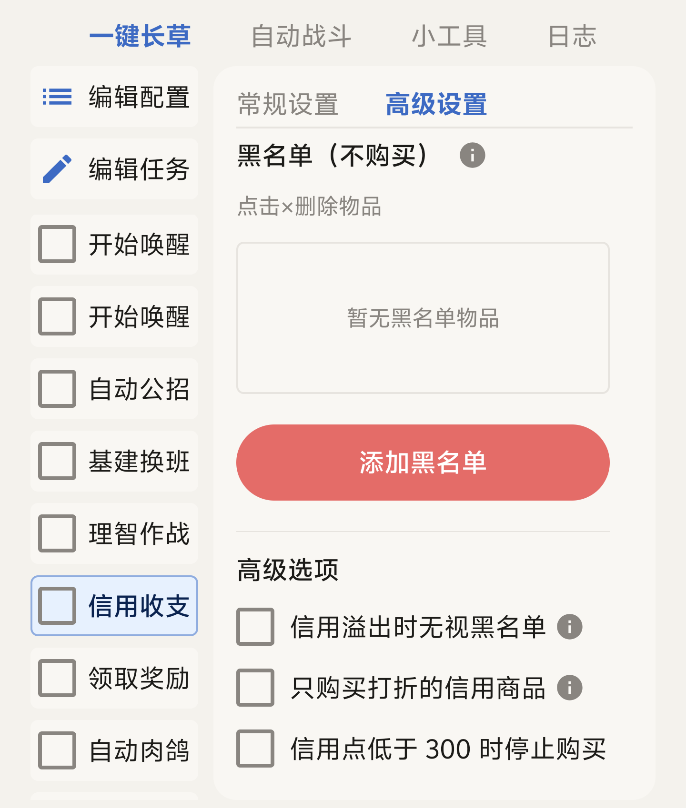

勾选后会自动访问好友获取信用点，并前往信用交易所购物。

借助战赚信用

MAA 会使用助战干员通关一次火蓝之心 OF-1，请确认该关卡已解锁。每日可获得额外信用点，但会消耗好友支援次数。

关卡选择为「当前/上次」时不会执行借助战任务。

购买优先级与黑名单

开启排序模式可调整优先级顺序，点击 × 删除。优先购买列表中的物品会按顺序优先购买。黑名单物品不会被购买，除非信用溢出且启用了强制购买。

## 领取奖励

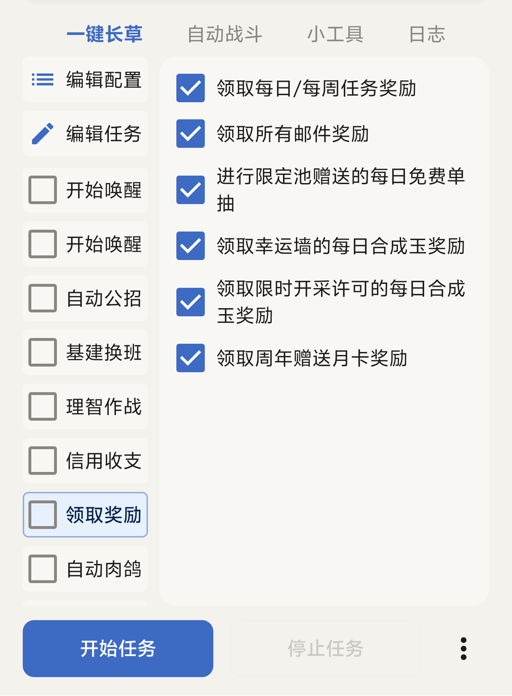

:::note
如果版本更新后出现 MAA 无法领取的奖励，请手动领取并等待更新。
:::
