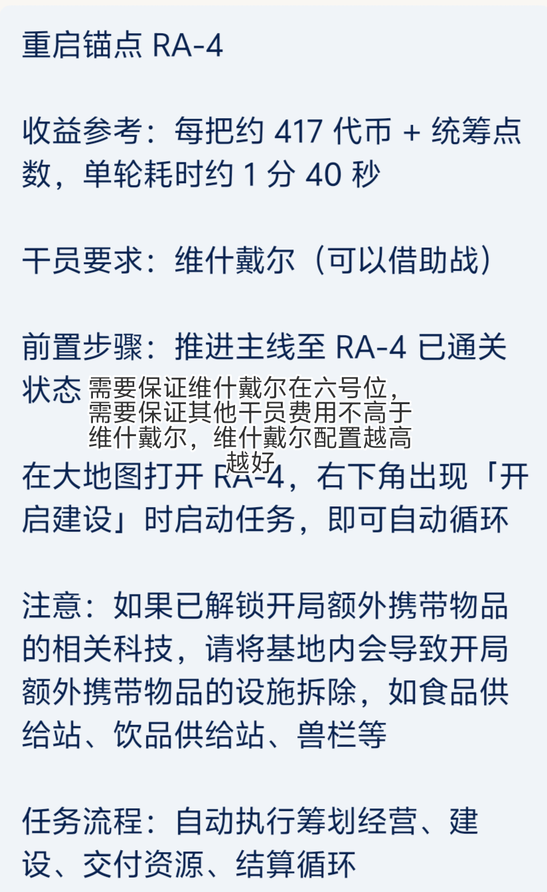
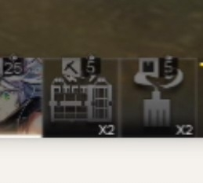
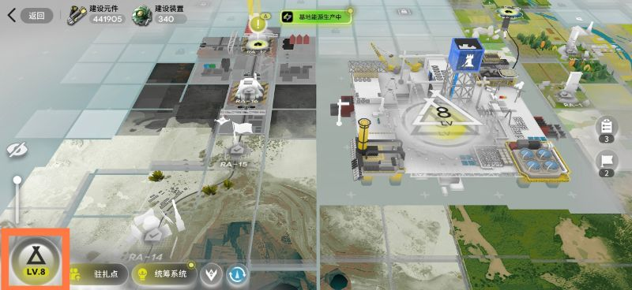
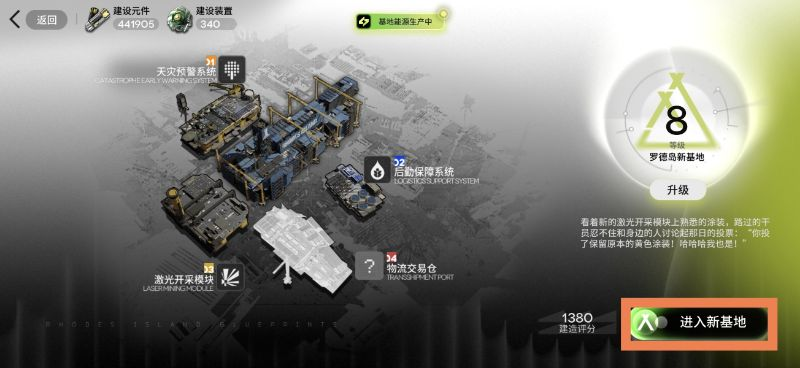
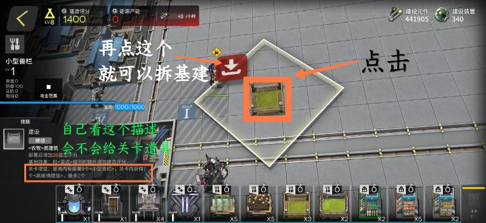
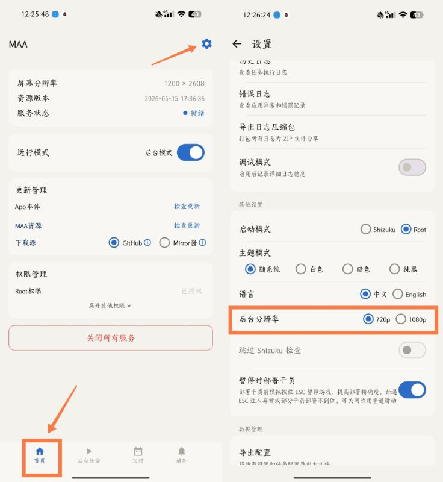
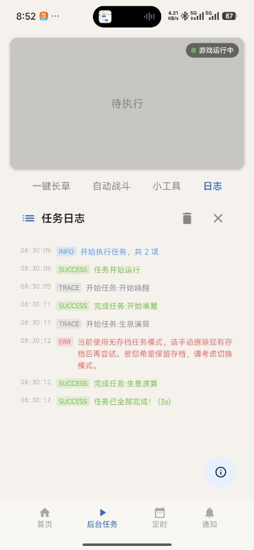

:::note
新生息演算目前还处于开发中。
:::

:::caution[凌晨四点]
明日方舟每天凌晨四点闪断更新会导致生息演算失败。由于重启锚点无法自动导航，请合理安排挂机时间，或等待重启锚点功能优化。
:::

## 选哪个关卡

| 关卡 | 效率 | 稳定性 | 适合谁 |
| --- | --- | --- | --- |
| RA-4 | 高 | 可能遇到小问题 | 能随时看两眼 MaaMeow 的人 |
| RA-15 | 慢一些 | 很少出问题 | 没空看 MaaMeow 的人 |

## 无法刷生息演算，一直在界面进进出出？

**不要停留在这个界面** 开始运行生息演算任务：

请跳转到对应的 RA-1、RA-4 或 RA-15 关卡界面，如下图所示。第四张为第一期的显示界面。

请注意阅读各关卡的说明：

怎么判断有没有拆基建？（附拆基建教程）

编队有额外道具的就是没有拆基建。

## 分辨率与阵容要求

以下来自部分群友体验，请自行验证。

RA-1

需要将分辨率调成 720p。

RA-4

需要将分辨率调至 1080p，并解锁「筹划经营分队」（即赤金分队）。

- 维什戴尔必须在六号位，其他干员费用不能高于维什戴尔，维什戴尔配置越高越好。
- 如果使用助战维什戴尔，请保证她在狙击助战首页（考虑挚友）。手动打开关卡，编入任意 5 个费用比维什戴尔低的干员，六号位选择维什戴尔助战后确认招募，放弃本次建设并在「开始建设」处开始。
- 保证队伍前五位有人且六号位为空。

RA-15

需要将分辨率调成 1080p，设置方式如下：

## 开始任务

最后勾选「生息演算」并开始任务。

:::caution[开始前确认]
- 游戏已启动，并且停在关卡对应的界面。
- 如果有正在运行的任务，请先点「停止任务」再点「开始任务」。
:::

第一期生息演算一点开始就失败

请检查是否游戏里有存档，但 MAA 选择了无存档模式。点击日志查看红字提示：

