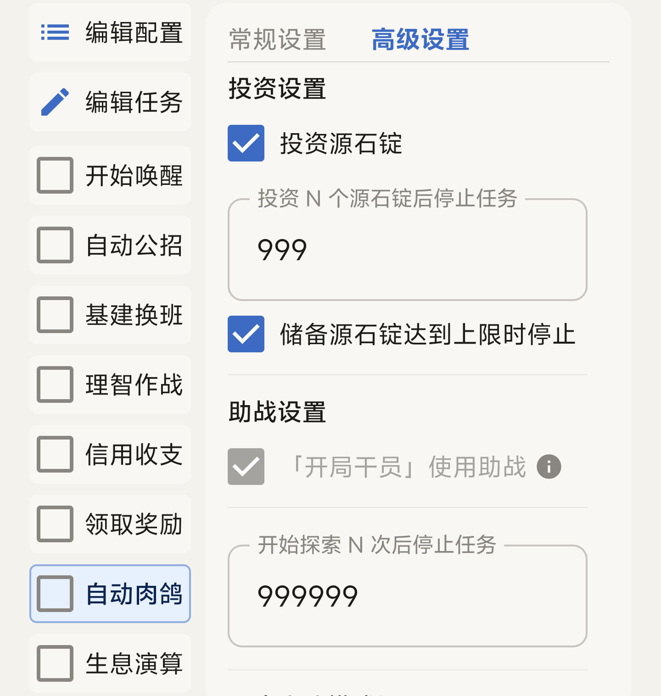

:::caution[凌晨四点]
明日方舟每天凌晨四点闪断更新会导致自动肉鸽失败。请合理安排挂机时间，或者添加定时任务「开始唤醒 + 自动肉鸽」。
:::

## 常规设置

可以切换集成战略主题、推荐分队、难度、策略和开局职业组。

- **难度 max** 默认为最高难度。MAA 每次开启肉鸽时都会自动切换难度。
- **月度小队** 即集成战略主界面的「游览者小队」，下图以界园肉鸽为例。

## 高级设置

勾选「投资源石锭」后一直推不动难度？

勾选后会无视策略选择，强制投资源石锭，可能导致没有足够的战力推进难度。

## 推荐配置

以下配置在高练度测试时比较稳定，难度推荐综合考虑了敌人难度、希望消耗、得分倍率等因素，可根据实际情况自由调整。

| 主题 | 难度 | 分队 | 职业组 | 干员 |
| --- | --- | --- | --- | --- |
| 傀影 | 正式调查 · 2 | 指挥分队 / 突击战术分队 | 取长补短 | 丰川祥子 / 棘刺 |
| 水月 | 波涛迭起 · 3 至 10 | 以人为本分队 / 心胜于物分队 | 稳扎稳打 | 维什戴尔 |
| 萨米 | 挑战自然 · 4 至 10 | 特训分队 / 远程战术分队 | 稳扎稳打 | 维什戴尔 |
| 萨卡兹 | 直面魂灵 · 4 至 10 | 蓝图测绘分队 / 远程战术分队 | 稳扎稳打 | 维什戴尔 |
| 界园 | 请君入园 · 3 至 10 | 指挥分队 / 远程战术分队 | 稳扎稳打 | 维什戴尔 |

各主题备注

- **傀影**：正式调查 3 及更高难度，开局可能获得减希望藏品，导致开局无法招募六星干员。
- **水月**：波涛迭起 4 及更高难度招募六星干员希望消耗 +1，使用心胜于物分队开局可能无法招募六星干员。以人为本分队适合账号练度较高的情况，心胜于物分队需要赌运气。
- **萨米**：挑战自然 6 及更高难度招募六星干员希望消耗 +1，使用特训分队开局可能无法招募六星干员。
- **萨卡兹**：直面魂灵 15 及更高难度招募六星干员希望消耗 +1，若未升级历史重构中的「蓝图测绘分队强化 II」，使用蓝图测绘分队开局可能无法招募六星干员。选择蓝图测绘分队会采用避战策略，可快速获取魂灵书签，但基本无法通关结局。使用刷源石锭策略且开局分队为点刺成锭分队时，会使用刷新商店策略加速流程。
- **界园**：请君入园 15 及更高难度招募六星干员希望消耗 +1，使用指挥分队开局可能无法招募六星干员。难度为请君入园 3 及更高、使用刷源石锭策略且开局分队为指挥分队时，会使用时光之末跳关策略加速流程。

