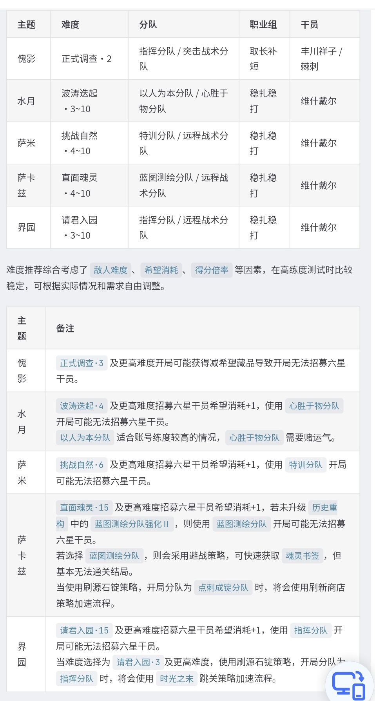
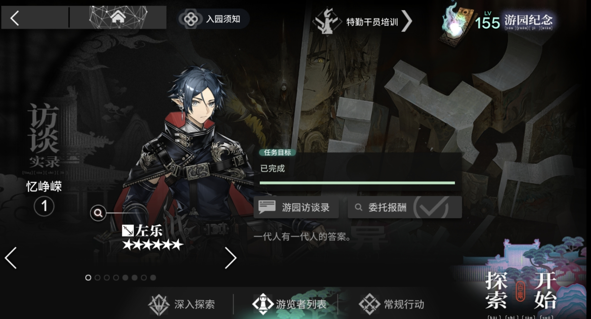
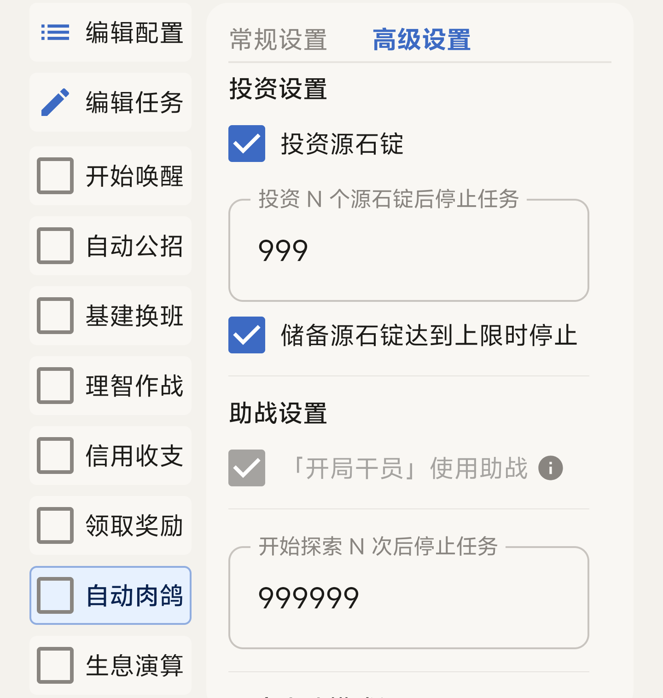

:::caution[凌晨四点]
明日方舟每天凌晨四点闪断更新会导致自动肉鸽失败。请合理安排挂机时间，或者添加[定时任务](/faq/schedule/)「开始唤醒 + 自动肉鸽」。
:::

## 常规设置

可以切换集成战略主题、推荐分队、难度、策略和开局职业组。

- **难度 max** 默认为最高难度。MAA 每次开启肉鸽时都会自动切换难度。
- **月度小队** 即集成战略主界面的「游览者小队」，下图以界园肉鸽为例。

任务自己停了，MAA 一直不点击

先确认肉鸽的新手教程有没有手动点掉。MAA 无法自动跳过新手教程引导，游戏停在教程界面时会识别异常并停止任务。请先自己进游戏把教程全部点完，回到可以正常操作的界面后再让 MAA 接管。

如果 MAA 卡在某个界面不动，可以在设置里把后台模式分辨率改为 1080P 再试。

## 高级设置

勾选「投资源石锭」后一直推不动难度？

勾选后会无视策略选择，强制投资源石锭，可能导致没有足够的战力推进难度。

## 推荐配置

以下配置在高练度测试时比较稳定，难度推荐综合考虑了敌人难度、希望消耗、得分倍率等因素，可根据实际情况自由调整。

| 主题 | 难度 | 分队 | 职业组 | 干员 |
| --- | --- | --- | --- | --- |
| 傀影 | 正式调查 · 2 | 指挥分队 / 突击战术分队 | 取长补短 | 丰川祥子 / 棘刺 |
| 水月 | 波涛迭起 · 3 至 10 | 以人为本分队 / 心胜于物分队 | 稳扎稳打 | 维什戴尔 |
| 萨米 | 挑战自然 · 4 至 10 | 特训分队 / 远程战术分队 | 稳扎稳打 | 维什戴尔 |
| 萨卡兹 | 直面魂灵 · 4 至 10 | 蓝图测绘分队 / 远程战术分队 | 稳扎稳打 | 维什戴尔 |
| 界园 | 请君入园 · 3 至 10 | 指挥分队 / 远程战术分队 | 稳扎稳打 | 维什戴尔 |
| 黑流树海 | 暂无 | 特勤分队 / 堡垒战术分队 | 稳扎稳打 / 坚不可摧 | 机械师（精二） |

各主题备注

- **傀影**：正式调查 3 及更高难度，开局可能获得减希望藏品，导致开局无法招募六星干员。
- **水月**：波涛迭起 4 及更高难度招募六星干员希望消耗 +1，使用心胜于物分队开局可能无法招募六星干员。以人为本分队适合账号练度较高的情况，心胜于物分队需要赌运气。
- **萨米**：挑战自然 6 及更高难度招募六星干员希望消耗 +1，使用特训分队开局可能无法招募六星干员。
- **萨卡兹**：直面魂灵 15 及更高难度招募六星干员希望消耗 +1，若未升级历史重构中的「蓝图测绘分队强化 II」，使用蓝图测绘分队开局可能无法招募六星干员。选择蓝图测绘分队会采用避战策略，可快速获取魂灵书签，但基本无法通关结局。使用刷源石锭策略且开局分队为点刺成锭分队时，会使用刷新商店策略加速流程。
- **界园**：请君入园 15 及更高难度招募六星干员希望消耗 +1，使用指挥分队开局可能无法招募六星干员。难度为请君入园 3 及更高、使用刷源石锭策略且开局分队为指挥分队时，会使用时光之末跳关策略加速流程。
- **黑流树海**：专用战斗策略尚在编写中，作战由通用策略决定，开局要求见下一节。

## 黑流树海

黑流树海目前没有专用战斗策略，作战由招募评分自动决策，刷源石锭、刷等级等策略都围绕精二机械师的「飞」展开。这个主题机制繁多，不按下面的配置开局就只能使用默认寻路与战斗，大概率失败。

| 项目 | 要求 |
| --- | --- |
| 开局干员 | 机械师，必须精二 |
| 开局分队 | 特勤分队 / 堡垒战术分队 |
| 开局职业组 | 稳扎稳打 / 坚不可摧 |

- 机械师精二只需通关一次 N1，相对简单。
- 精二后完成「招募精通 II」的「效果提升 II」，开局就能携带「结构性原理」，可以全图任意飞 3 次。解锁条件是精二后累计卖出 10 个零件，强烈推荐先解锁。未解锁时只能向周围 8 格飞 3 次，也能刷，但效率低不少。
- 刷等级时，精二机械师加上述分队与职业组，再带重装券，可以快速飞完三层。
- 刷等级且不勾选「投资源石锭」时会跳过商店。
- 没有精二机械师就不要选机械师，请换其他无召唤物的强力干员开局。这种情况可以正常刷源石锭，但战斗大概率失败，其他策略有待后续优化。

以上要求只针对黑流树海，傀影、水月、萨米、萨卡兹、界园不需要这样配置。

刷等级报错，卡在第二层的「失与德」或「先行一步」

先确认开局配置符合上面的要求：机械师已经精二，天赋已经解锁。

配置都正确仍然卡在第二层的话，检查是否勾选了「投资源石锭」。勾选后可能会错误地飞到鸟瞰点，导致任务失败。

