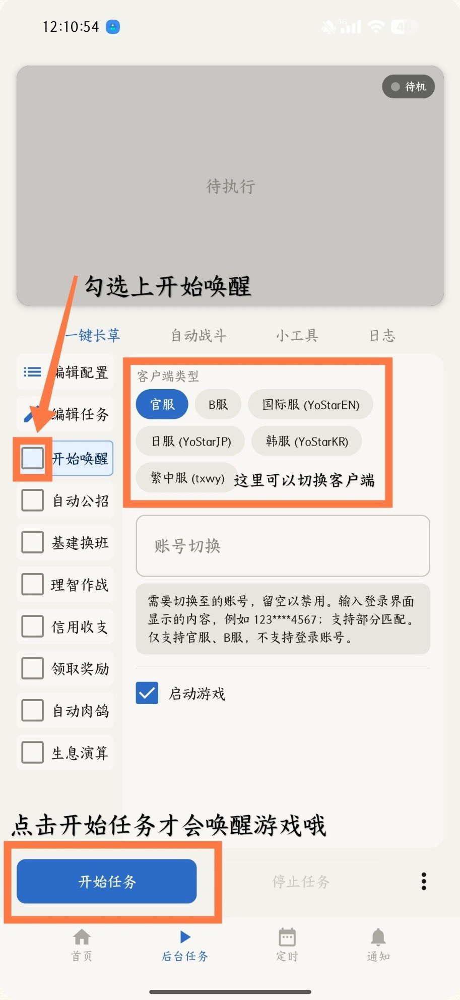
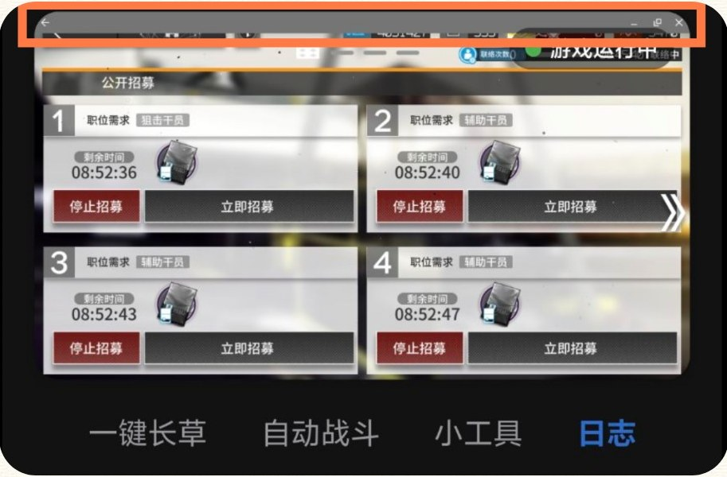
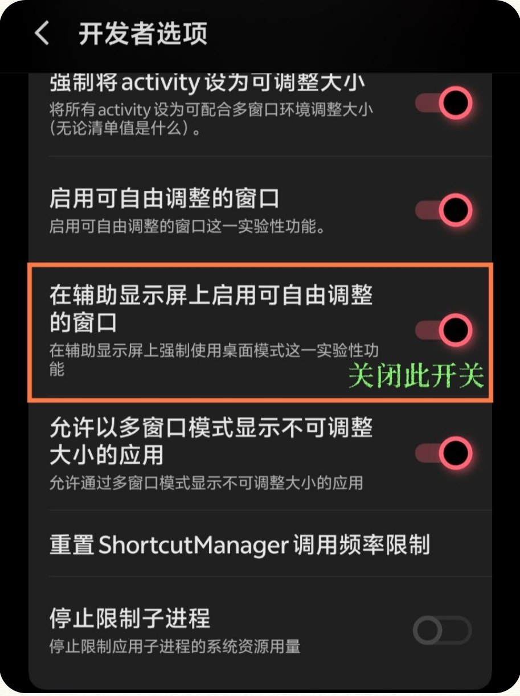
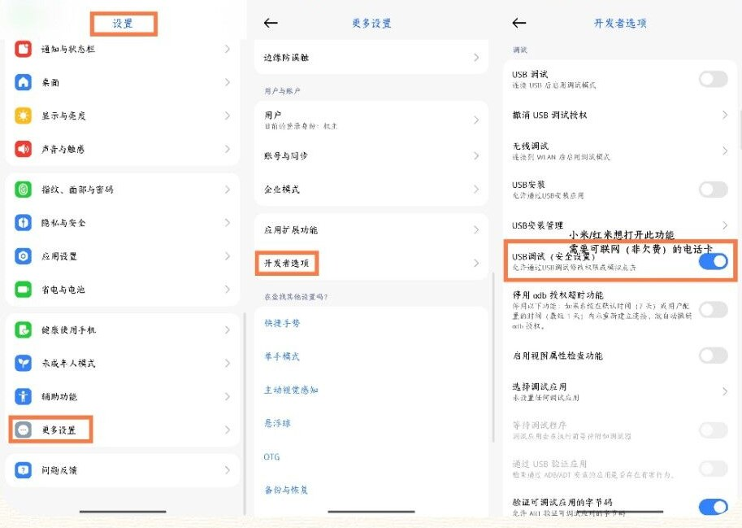
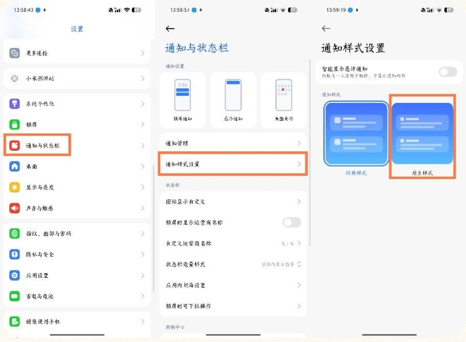
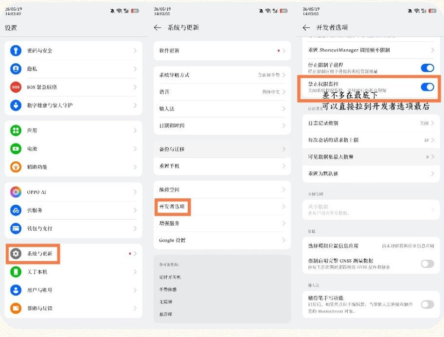
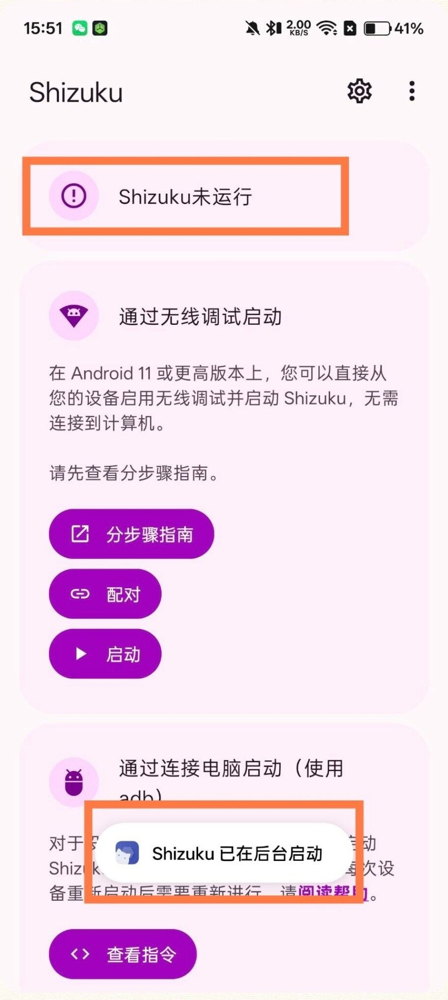
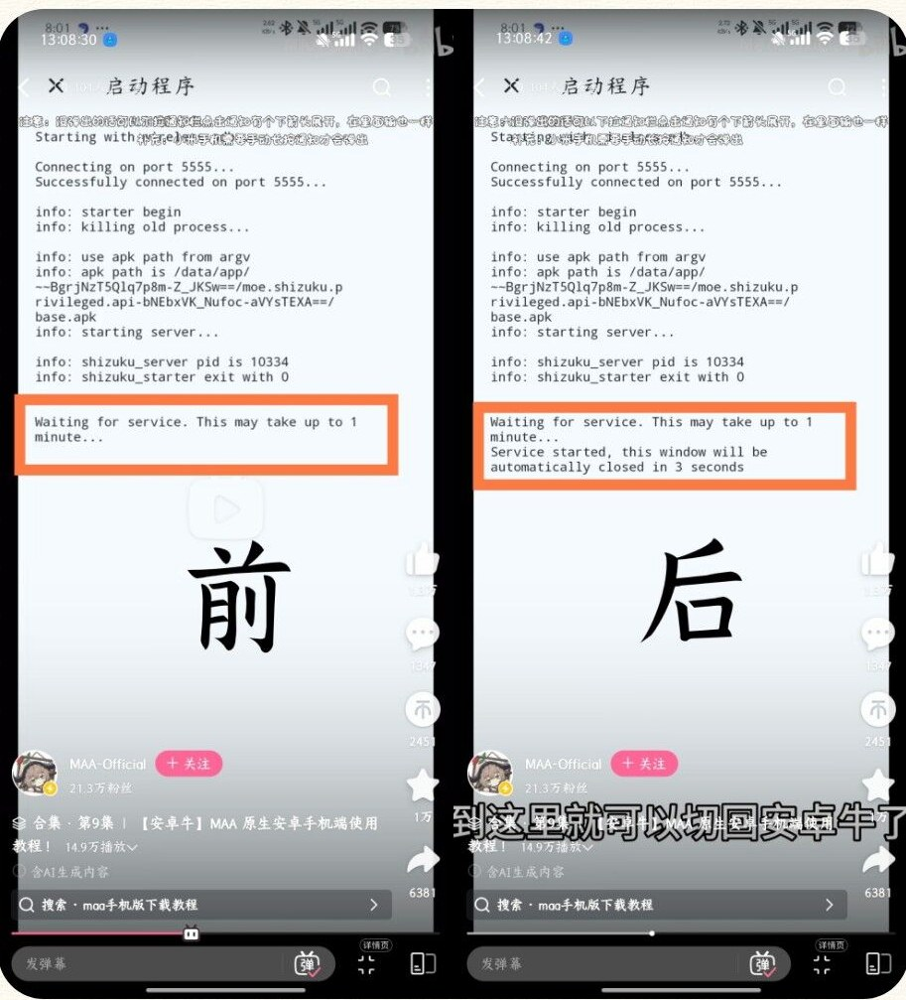

遇到问题先做三件事：更新到最新版本、完整重启一次 MaaMeow、按[正确的提问方式](/faq/getting-started/#关于提问的正确方式)收集日志。下面是群里最常见的几类问题。

## 截图失败

<details class="faq" open>
<summary>提示截图失败，任务跑不起来</summary>

大部分是因为没有唤醒游戏。把「开始唤醒」勾上，再点「开始任务」即可。注意只有点了开始任务才会真正唤醒游戏。

「客户端类型」也在这个界面切换，请确认选的是你实际在玩的服务器。



</details>

## 辅助窗口上方出现遮挡横条

<details class="faq" open>
<summary>MAA 顶部的游戏画面上多了一条窗口标题栏</summary>

出现下图这样的横条，是系统开发者选项里的「桌面模式」把辅助显示屏当成了自由窗口。



进入系统「开发者选项」，找到 **「在辅助显示屏上启用可自由调整的窗口」**，把它关闭。



</details>

## 触控出问题

不同品牌手机对后台触控和 ADB 的限制不同，请按品牌调整。开发者选项的打开方式请自行在 B 站搜索对应品牌的教程。

| 品牌 | 解决办法 |
| --- | --- |
| 小米 / 红米（MIUI、HyperOS） | 1. 打开「USB 调试（安全设置）」。注意这和「USB 调试」是两个分开的选项，打开时需要插入可联网的电话卡。<br />2. 系统设置 → 通知管理 → 通知显示设置，把通知样式切换为「原生样式」。<br />3. 不要使用「手机管家」的扫描功能，它会禁用开发者选项。 |
| OPPO / 一加（ColorOS）、真我（realme UI） | 1. 在「开发者选项」中打开「禁止权限监控」。<br />2. ColorOS 16.0.7 及以上，该项改名为「禁用系统优化」且开关被隐藏，需要把系统语言切换到英文，找到 "Disable system optimization"。 |
| 华为（EMUI） | 在「开发者选项」中开启「"仅充电"模式下允许 ADB 调试」。 |
| 魅族（Flyme） | 在「开发者选项」中关闭「Flyme 支付保护」。 |
| 通用 | 打开「停用 adb 授权超时功能」。 |

<details class="faq">
<summary>小米 / 红米：USB 调试（安全设置）在哪</summary>

设置 → 更多设置 → 开发者选项，找到「USB 调试（安全设置）」并打开。



</details>

<details class="faq">
<summary>小米 / 红米：切换原生通知样式</summary>

设置 → 通知与状态栏 → 通知样式设置，选择「原生样式」。



</details>

<details class="faq">
<summary>OPPO / 一加 / 真我：禁止权限监控在哪</summary>

设置 → 系统与更新 → 开发者选项，拉到接近最底部找到「禁止权限监控」并打开。



</details>

## Shizuku 问题

:::tip[先看官方视频]
在 B 站搜索 **BV1reLp6GEeF**，这是 MAA 官方的「原生安卓手机端使用教程」，Shizuku 的完整配对流程都在里面。
:::

<details class="faq" open>
<summary>Shizuku 显示「已在后台启动」，但界面仍是「未运行」，无法给 MAA 授权</summary>



绝大多数情况是输入完配对码、点击启动后，**还没等 Shizuku 运行完毕就切出了界面**。可以看官方视频的 46 至 55 秒。

解决办法：把 Shizuku 从后台划掉，或者卸载重装，重新配对后再启动。启动时 **必须停留在启动界面等待**，直到出现「Service started」字样再切回 MAA。



</details>

<details class="faq">
<summary>启动日志报 TimeoutException</summary>

日志里出现下面这种内容：

```text
Waiting for service. This may take up to 1 minute...
java.util.concurrent.TimeoutException: Failed to receive binder within 1 minute
    at rikka.shizuku.Uv.a(SourceFile:95)
    ...
```

可以按顺序尝试：

1. 在 B 站搜索「shizuku 解决错误」相关视频，自行阅读理解。
2. 换一个 Shizuku 版本，群文件里有不同版本。
3. 把截图发给 AI（豆包、DeepSeek 等），询问出现了什么情况。
4. 问群友，请态度好一些。
5. 群友解决不了的，找管理，不保证能解决。

</details>

## 无法刷生息演算

这个问题单独整理在[生息演算](/faq/reclamation/#无法刷生息演算一直在界面进进出出)页面，核心是不要停留在主界面开始任务，要先手动跳转到对应关卡。
